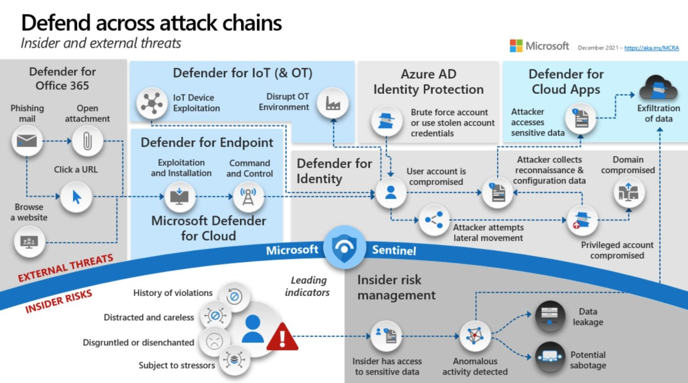

## Assumed Knowledge

This project is intended to remove friction to "getting shit done" and as such there is a certain amount of "assumed knowledge" that you are already somewhat experienced with the Microsoft Defender Security Suite of tools - in particular the 4 main pillars of MDI, MDE, MDO and MDCA (was MCAS) - if not then please consider having a good review of the Core Reference material below.

However, if you've already got a reasonably good handle on this, don't let us stop you - dive straight in and "get shit done" ;-)

## Assumed Licensing

**ALL** of this content is assuming that your M365 Tenant is at FULL E5 including Security and Compliance.
For details regards M365 Features and Licensing see this: - [Feature Matrix | M365 Maps](https://m365maps.com/matrix.htm) 

If you need further assistance in Licensing please contact your local Microsoft Sales rep and start from there. 
Apologies, but this content is focused and aimed at helping people get the solutions deployed.

## Core reference material

-   **Microsoft Cybersecurity Reference Architecture -- <https://aka.ms/MCRA>** [Direct link](<https://github.com/MicrosoftDocs/security/blob/main/Downloads/microsoft-cybersecurity-reference-architectures.pptx?raw=true>)  
-   **Security collateral inc. CISO Workshops, and lots more -- <https://aka.ms/MarksList>**
    -   Please - if you haven't come across these two links above before now - feel free to go and review and come back after and pick up here when done.

Please make sure you review the MCRA slide deck & slide 15 - all of the slide is hyperlinked to other additional useful info - so have a good browse first and then if you have further questions on these 4 solution areas it might be worth reviewing the Ninja Training section?

## Ninja Security Training
Subset here of the core pillars:

-   M365 Defender : <https://aka.ms/m365dninja>
-   Microsoft Defender for Endpoint: <https://aka.ms/mdeninja>
-   Microsoft Defender for Identity : <https://aka.ms/MDINinja>
-   Microsoft Defender for O365 : <https://aka.ms/mdoninja>
-   Microsoft Defender for Cloud Apps: <http://aka.ms/mcasninja> (formerly MCAS)
-   More at [Ninja Security Training](./Ninja.md)

## How was this site created
From MkDocs & Material:

-   [MkDocs](<https://www.mkdocs.org/>)
-   [Github Actions Marketplace = MkDocs](<https://github.com/marketplace?category=&query=mkdocs+sort%3Apopularity-desc&type=actions&verification=>)
-   [mkdocs-simple-plugin](<https://www.althack.dev/mkdocs-simple-plugin/v2.1.3/mkdocs_simple_plugin/plugin/>)
-   [Material theme](<https://squidfunk.github.io/mkdocs-material/getting-started/>)

Key takeway - no need to touch Docker, Linux or Python, just let a plugin do the heavy lifting for you
