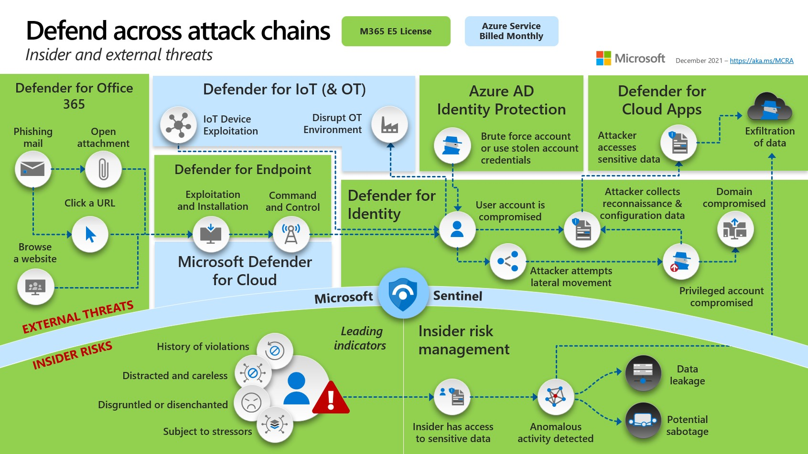
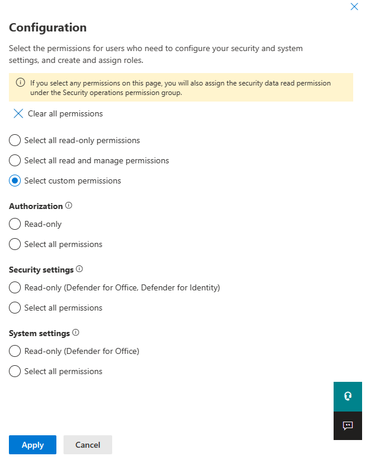
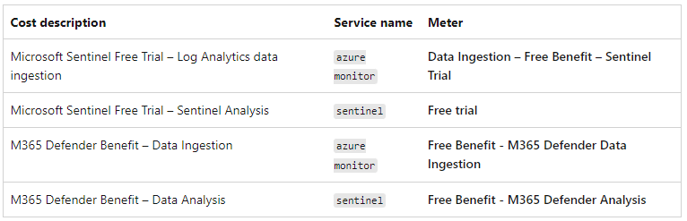
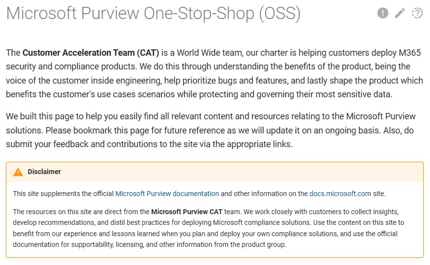
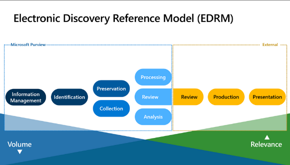
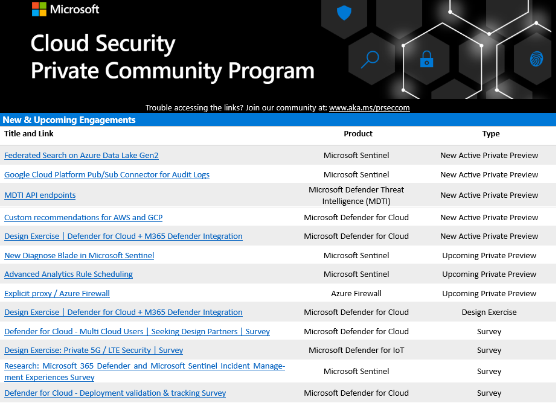

# **Get Security Done (GSD) - Microsoft Security & M365 Defender**

Quick wins to improve Security using existing M365 E5 entitlements

!!! warning "Disclaimer (you know the drill :-) )"

    -    Essentially this is "Notes from the Field" - not necessarily Best Practices
    -    Please use this information wisely, at your own risk
    -    Ideally this page will be highlighting how to get the best out of both your M365 E5 security and compliance entitlements. What is the best way to step lightly thru this and gain maximum benefit for the least effort? 
    -    While most of the focus here is more on the M365 SaaS Security platform elements, not necessarily on Sentinel or Azure, there will be plenty of crossover.

## **Core reference material**

- **Microsoft Cybersecurity Reference Architecture -- <https://aka.ms/MCRA>** - [**Direct link**](<https://github.com/MicrosoftDocs/security/blob/main/Downloads/mcra-december-2023.pptx?raw=true>)
- **Security collateral inc. CISO Workshops, and lots more -- <https://aka.ms/MarksList>**
  - Please - if you haven't come across these two links above
        before now - go and review and come back after
- ASD Essential 8 Security controls - Microsoft Whitepaper - <http://aka.ms/e8guides>
- Everything regards M365 Features and Licensing - [Feature Matrix | M365 Maps](https://m365maps.com/matrix.htm)
  - Aaron Dinnage, Microsoft Canberra
  - Plan comparison in detail - <https://aka.ms/M365EnterprisePlans>

A new end-to-end Total Economic Impact study by Forrester across Microsoft's threat protection security portfolio has been released. <https://lnkd.in/dw7Hny6d>

👉 “The best example of doing more with less is our #SOC. We have a 24/7 operation with only four people and a $250,000 managed services contract. Without Microsoft’s #XDR solution and everything working in #Sentinel, I would need 12 to 16 people working in the SOC.”

✅ #ROI 231%
✅ #Payback in < 6 months
✅ #Reduced likelihood of a #breach 72%
✅ #Reduced security license #costs 25%

👉 Get the report: <https://lnkd.in/dw7Hny6d>

### **Latest CISO Workshop Training**

[The Chief Information Security Officer (CISO) Workshop Training](<https://learn.microsoft.com/en-gb/security/ciso-workshop/the-ciso-workshop>)

### **Incident Response**

- CISO Lens Incident Response Template - November 2022 <https://www.cisolens.com/reports#h.a769cex3vkl>
- ACSC Exercise in a box <https://www.cyber.gov.au/exercise-in-a-box>
- Standardised Executive Reporting - an industry report from the CISO Lens community (June 2022)
        <https://www.cisolens.com/reports#h.z10davb23frq>

## **M365 Defender Console**

- Evaluate Defender 365
  - Good step by step guide to getting everything turned on - but it is aimed at folks just starting
  - <https://learn.microsoft.com/en-gb/microsoft-365/security/defender/eval-overview>
- Test Use Cases
    <https://learn.microsoft.com/en-gb/microsoft-365/security/defender/integrate-microsoft-365-defender-secops-use-cases>
- SOC Maintenance Tasks
    <https://learn.microsoft.com/en-gb/microsoft-365/security/defender/integrate-microsoft-365-defender-secops-tasks>

- Deploying Microsoft 365 just got easier - Introducing advanced deployment guides! (Dec 15th, 2022)

    <https://techcommunity.microsoft.com/t5/fasttrack-blog/deploying-microsoft-365-just-got-easier-introducing-advanced/ba-p/3635421>

**Defender Admin Guides - Step by Step**

- <https://setup.microsoft.com/defender>
- <https://setup.microsoft.com/defender/identity>
- <https://setup.microsoft.com/defender/cloud-apps-setup-guide>
- <https://setup.microsoft.com/defender/endpoint-setup-guide>
- <https://setup.microsoft.com/defender/office-365-setup-guide>
- <https://setup.microsoft.com/intune/setup-guide>

**Purview Admin Guides - Step by Step**

- <https://setup.microsoft.com/purview>
- <https://setup.microsoft.com/purview/audit-solutions-setup-guide>
- <https://setup.microsoft.com/purview/ediscovery-solutions-setup-guide>
- <https://setup.microsoft.com/purview/insider-risk-solutions-setup-guide>
- <https://setup.microsoft.com/purview/data-lifecycle-management-setup-guide>
- <https://setup.microsoft.com/purview/information-protection>
- <https://setup.microsoft.com/purview/security-analyzer>
- <https://setup.microsoft.com/purview/zero-trust-setup-guide>

## **1.   MDI (Microsoft Defender for Identity)**

### **Ways of working**

First decision point - do you have **ANY** Domain Controllers within your environment? If so then you should install MDI **NOW** and make it the very top of your Security ToDo list.

Examples of **WHY** you do this first:

- Small Customer in 2018, back when this was called "Azure ATP", installed only as a PoC and in under 48 hours it had identified a mis-configured Server that was exposed to the internet and was being brute-forced via RDP from Eastern Europe.
- Larger environment 2020, client not sure but was wanting to lock down Legacy Auth, suggested that as they had E5 **strong recommendation** to deploy MDI ASAP across DC's. After getting CAB Approval to deploy, and with less than 10% coverage of DC's in just over a week it popped up with "NTDIS Exfil via SMB"
- Security Value = **Priceless**

### **Enable Telemetry**

Start here - <https://learn.microsoft.com/en-us/defender-for-identity/prerequisites>

1. Capacity planning - <https://learn.microsoft.com/en-us/defender-for-identity/capacity-planning>
2. Download the Sizing tool - <https://github.com/microsoft/ATA-AATP-Sizing-Tool/releases>
3. Download the Sensor - <https://learn.microsoft.com/en-us/defender-for-identity/download-sensor>
4. Install the Sensor on DC's - <https://learn.microsoft.com/en-us/defender-for-identity/install-sensor>
5. Basic Settings that you should review **NOW** - <https://www.microsoft.com/videoplayer/embed/RWFVEX>

This will do for now, especially if you are in a crisis mode, check the console for the DC's being online - now move on to validation below.
Please follow up with all other Configuration steps as soon as practible, especially if you also have ADFS in play.
For ADFS please also check - <https://learn.microsoft.com/en-us/defender-for-identity/active-directory-federation-services>

### **Validate and Test**

Be conscious that if you are testing that MDI is working correctly that this may trigger **high impact** Alerts to your Blue Team or existing SecOps IF it's already installed and being monitored - or for that matter if another tooling is in place to monitor the same behaviour - so if doing some major testing it's worthwhile letting them know before hand? And on that, make sure you schedule some time to review afterwards about what testing/alerting was created & what was visible from a SecOps perspective?

This would be valuable lessons on effectiveness - even more so if there is missing alerts?? :(

- Specific Validation information - <https://learn.microsoft.com/en-us/defender-for-identity/configure-sensor-settings#validate-installations>
- Use Attack Simulations to **validate MDI is installed correctly** and Alerts are being surfaced accurately:
    <https://learn.microsoft.com/en-us/defender-for-identity/playbooks>
- Use Labs for **in depth checking**: <https://learn.microsoft.com/en-us/defender-for-identity/playbook-lab-overview>
- <https://learn.microsoft.com/en-us/defender-for-identity/playbook-domain-dominance>
- Go to <https://portal.atp.azure.com> and if you see this, it's not been installed correctly

### **Enable Reporting**

Once enabled you should now have a lot more visibility into the Security Posture of the onPrem environment - including the following:

- Domain controllers with Print Spooler service available
- Dormant entities in sensitive groups
- Entities exposing credentials in clear text
- Microsoft LAPS usage
- Legacy protocols usage
- Riskiest lateral movement paths (LMP)
- Unmonitored domain controllers
- Unsecure account attributes
- Unsecure domain configurations
- Unsecure Kerberos delegation
- Unsecure SID History attributes
- Weak cipher usage

More details can be found here & example below - <https://learn.microsoft.com/en-us/defender-for-identity/security-assessment#assessment-reports>

### **Review and Improve as needed**

- Review Security Assessments to validate what potentially needs remediation: <https://learn.microsoft.com/en-us/defender-for-identity/security-assessment#assessment-reports>
- Full list of the 44 Alerts that are being checked on your behalf when fully deployed: <https://learn.microsoft.com/en-us/defender-for-identity/alerts-overview>
- If you do not use the default Administrator account (ideally have it disabled?) then please add it to the Honeytoken account list: <https://learn.microsoft.com/en-us/defender-for-identity/entity-tags#honeytoken-tags>
- Audit checking via Sentinel for MDI - <https://thalpius.com/2022/12/14/microsoft-defender-for-identity-auditing-checker-using-sentinel>

### **Troubleshooting**

- <https://learn.microsoft.com/en-us/defender-for-identity/troubleshooting-known-issues>
- <https://learn.microsoft.com/en-us/defender-for-identity/troubleshooting-using-logs>

## **2.   Conditional Access**

### **Ways of working**

First decision point - how are we going to do this?
Questions to help you determine this are:

1. Is it small or a large Tenancy?
2. Do we want to avoid CAB approval process for a PoC?
3. Need it done right now to address a strategic problem?
4. Do we want to go fast, or take our time?
5. If you are a Partner or MSSP please choose the "As-Code" method

Result:

- Fast and quick - start with telemetry below and do it on the fly using Policies in Reporting Mode, iterate from there...
- Larger implmentations - please take the time to review the process below to enable via "CA-as-Code" as the ROI is well worth it - especially if doing it for more than one customer or tenant :wink:

### **Enable Telemetry**

!!! warning "**NOTE: please be aware there is no inherent "BLOCK" by default**"
    You need to make sure you are BLOCKING by default unless explicitly allowing access - walk thru the 14 default Policies to better understand this. To make sure that you are fully covered please use this PowerBI based tool **<https://github.com/AzureAD/AzureADAssessment>**
    **Confirm your maturity based on this Tool ^^^^^^**
     

!!! Note
    **UPDATE** 142 Page - CA demystified Whitepaper - still to be reviewed
    <https://github.com/kennethvs/cabaseline202212/blob/main/Conditional%20Access%20demystified-v1.4%20-%20December%202022.pdf>
  
### **The Microsoft content**

- Design - <https://learn.microsoft.com/en-us/azure/architecture/guide/security/conditional-access-design>
- Architecture - <https://learn.microsoft.com/en-us/azure/architecture/guide/security/conditional-access-architecture>
- Framework - <https://learn.microsoft.com/en-us/azure/architecture/guide/security/conditional-access-framework>
- API - <https://learn.microsoft.com/en-us/azure/active-directory/conditional-access/howto-conditional-access-apis>
- Deployment - <https://github.com/Azure-Samples/azure-ad-conditional-access-apis/tree/main/03-deploy>
- Plan - <https://learn.microsoft.com/en-us/azure/active-directory/conditional-access/plan-conditional-access>
- CA for Cloud Apps - <https://learn.microsoft.com/en-us/azure/active-directory/conditional-access/concept-conditional-access-cloud-apps>
- Concept for CA Policies - <https://learn.microsoft.com/en-us/azure/active-directory/conditional-access/concept-conditional-access-policies>
- Docs - <https://learn.microsoft.com/en-us/azure/active-directory/conditional-access/>
- Powershell syntax and examples - <https://learn.microsoft.com/en-us/powershell/module/azuread/get-azureadmsconditionalaccesspolicy?view=azureadps-2.0>
- Deep dive: How does Conditional Access block Legacy Authentication? - <https://techcommunity.microsoft.com/t5/itops-talk-blog/deep-dive-how-does-conditional-access-block-legacy/ba-p/3265345>

!!! Note
    Here is a great companion for Sentinel:
    <https://danielchronlund.com/2022/04/21/a-powerfull-conditional-access-change-dashboard-for-microsoft-sentinel/>
>

### **Automation of "CA-as-Code"**

- Thomas N. - <https://www.cloud-architekt.net/speaking/> The most recent deck -- 2022-06-11 Scottish Summit 2022 "Deploying and Managing Conditional Access at Scale" [Slides](https://github.com/Cloud-Architekt/meetups/blob/master/2022-06-10%20ScottishSummit-Deploying-and-Managing-ConditionalAccess-at-Scale.pdf)

- Excellent article here that is really worth the time reading as this will highlight how to enable this in detail: <https://www.cloud-architekt.net/aadops-conditional-access/>

!!! Tip
    He also points out the others that have done great work in this space:

- Fortigi/ConditionalAccess: (<https://github.com/Fortigi/ConditionalAccess>)
- AlexFilipin/ConditionalAccess: (<https://github.com/AlexFilipin/ConditionalAccess>)
- DanielChronlund/DCToolbox: Tools for Microsoft cloud fans (<https://github.com/DanielChronlund/DCToolbox>)

!!! Info
    One other important point -- don't get caught up trying to manage GUID's:

- [Fortigi has published some build scripts on GitHub](https://github.com/Fortigi/ConditionalAccess) to convert those GUIDs to readable display names.
- This also covers known GUIDs such as AAD Role and Application ID to DisplayName.

### **Validate and Test**

<https://learn.microsoft.com/en-us/azure/active-directory/conditional-access/what-if-tool>

<https://www.cloud-architekt.net/aadops-conditional-access/>

### **Enable Reporting**

<https://learn.microsoft.com/en-us/azure/active-directory/conditional-access/howto-conditional-access-insights-reporting>

### **Review and Improve as needed**

Rerun check with AzureAD Assessment Tool

### **Troubleshooting**

<https://learn.microsoft.com/en-us/azure/active-directory/conditional-access/plan-conditional-access#troubleshoot-conditional-access-policy>

Check for common misconfigurations - <https://www.trustedsec.com/blog/common-conditional-access-misconfigurations-and-bypasses-in-azure/>

## **3.   Microsoft Defender for Cloud Apps (MDCA), was MCAS)**

### **Ways of working**

First decision point - Simple or Complex, i.e. do you need to be concerned about RBAC for instance becuase of the scale of the installation or the number of different parties that **may** need access to part or some parts of the console?  <https://learn.microsoft.com/en-us/defender-cloud-apps/manage-admins>

### **Enable Telemetry**

- Basic Setup --> Start here:
<https://learn.microsoft.com/en-us/defender-cloud-apps/general-setup>
<https://learn.microsoft.com/en-us/defender-cloud-apps/get-started>
- Tell it what the Corporate IP address's are:
<https://learn.microsoft.com/en-us/defender-cloud-apps/ip-tags>
- Set the IP's in bulk if needed:
<https://learn.microsoft.com/en-us/defender-cloud-apps/api-data-enrichment-manage-script>
- Enable File Monitoring:
<https://learn.microsoft.com/en-us/defender-cloud-apps/file-filters>
- Add native App Connectors: (Atlassian, Google, Azure, AWS, Box, DocuSign, Github, Okta, Salesforce, ServiceNow, Slack, Workday, etc... )
<https://learn.microsoft.com/en-us/defender-cloud-apps/enable-instant-visibility-protection-and-governance-actions-for-your-apps>
- Best Practices:
<https://learn.microsoft.com/en-us/defender-cloud-apps/best-practices>
- Daily Activities:
<https://learn.microsoft.com/en-us/defender-cloud-apps/daily-activities-to-protect-your-cloud-environment>

The best practices discussed in the link above include:

- Discover and assess cloud apps
- Apply cloud governance policies
- Limit exposure of shared data and enforce collaboration policies
- Discover, classify, label, and protect regulated and sensitive data stored in the cloud
- Enforce DLP and compliance policies for data stored in the cloud
- Block and protect download of sensitive data to unmanaged or risky devices
- Secure collaboration with external users by enforcing real-time session controls
- Detect cloud threats, compromised accounts, malicious insiders, and ransomware
- Use the audit trail of activities for forensic investigations
- Secure IaaS services and custom apps

!!! warning
    -   For best protection, we recommend selecting all Office 365 components.
    -   The Office 365 files component, requires the Office 365 activities component and Defender for Cloud Apps file monitoring (Settings > Files > Enable file monitoring).
    -   Make sure the **last** checkbox (Office 365 Files) in the image below is **"checked"** [link to more details](<https://learn.microsoft.com/en-us/defender-cloud-apps/connect-office-365>)

### **Validate and Test**

- Enable MDE Integration
<https://learn.microsoft.com/en-us/defender-cloud-apps/mde-integration>
- Enable MDI Integration
<https://learn.microsoft.com/en-us/defender-cloud-apps/mdi-integration>
- Govern discovered Apps using MDE (enables blocking of unwanted Apps)
<https://learn.microsoft.com/en-us/defender-cloud-apps/mde-govern>
- Investigating via Dashboard:
<https://learn.microsoft.com/en-us/defender-cloud-apps/investigate>
- Tune the system:
<https://learn.microsoft.com/en-us/defender-cloud-apps/tutorial-suspicious-activity>
- Investigate & remediate risky OAuth Apps:
<https://learn.microsoft.com/en-us/defender-cloud-apps/investigate-risky-oauth>

!!! note
    -   It takes up to two hours after you enable the integration for the data to show up in Defender for Cloud Apps.
    -   [List of supported Firewalls and Proxies](<https://learn.microsoft.com/en-us/defender-cloud-apps/set-up-cloud-discovery#supported-firewalls-and-proxies->)
    -   Follow link above for Integration steps with ZScaler, iboss, Menlo, etc...

### **Enable Reporting**

- Investigate Apps discovered by MDE
<https://learn.microsoft.com/en-us/defender-cloud-apps/mde-investigation>
- Governance for Connected Apps:
<https://learn.microsoft.com/en-us/defender-cloud-apps/governance-actions>
This is where this process gets really good, have a real good look at all the possibilities here to be able to be able to track what is being done with data inside the environment - don't jump in & start blocking things before you understand the full business implications.
- Governance for discovered Apps:
<https://learn.microsoft.com/en-us/defender-cloud-apps/governance-discovery>
Now we can take this one step further and we can now determine which of the 26,000 SaaS Apps I want to allow or block - the only real limitation (to a certain extent) is that the user is using corporate credentials from our AAD via an endpoint enabled with MDE

### **Review and Improve as needed**

- Add Conditional Access App Control into the mix - this is where we are starting to get more into Zero Trust - so don't jump in here first, make sure the rest of the Security settings are in place and then come back to this in a later phase
<https://learn.microsoft.com/en-us/defender-cloud-apps/proxy-intro-aad>

There is a lot more to be covered, but this will do for now, if you have questions please let us know?
<https://github.com/dcaddick/gsd_public/discussions>

### **Troubleshooting**

- Advanced Settings URL:
<https://security.microsoft.com/cloudapps/settings>
- Troubleshooting:
<https://learn.microsoft.com/en-us/defender-cloud-apps/troubleshooting-cloud-discovery>

- Apps list
- Sanctioned/Unsanctioned
- Don't forget this is based on MDE so go back and check the MDE integration link above

## **4.   MDE (Microsoft Defender for Endpoint)**

### **Ways of working**

Defender for Endpoint is for Endpoints, Servers actually belong in "Defender for Cloud":
<https://learn.microsoft.com/en-us/microsoft-365/security/defender-endpoint/migrating-mde-server-to-cloud>

- **Architecture PDF**
<https://download.microsoft.com/download/5/6/0/5609001f-b8ae-412f-89eb-643976f6b79c/mde-deployment-strategy.pdf>

- **Plan your deployement**
<https://learn.microsoft.com/en-us/microsoft-365/security/defender-endpoint/deployment-strategy?view=o365-worldwide>

- **MDE Deployment overview**
<https://learn.microsoft.com/en-us/microsoft-365/security/defender-endpoint/deployment-phases?view=o365-worldwide>

- **Phase 1 - Prepare** [Link](<https://learn.microsoft.com/en-us/microsoft-365/security/defender-endpoint/prepare-deployment?view=o365-worldwide>)
  - Stakeholders and approval
  - Environment
  - RBAC
  - Adoption Order

- **Phase 2 - Setup** [Link](<https://learn.microsoft.com/en-us/microsoft-365/security/defender-endpoint/production-deployment?view=o365-worldwide>)
  - Check License state
  - CSP Validation
  - Tenant Config
  - Data Centre location
  - Network Config

- **Phase 3 - Onbaording** [Link](<https://learn.microsoft.com/en-us/microsoft-365/security/defender-endpoint/production-deployment?view=o365-worldwide>)
  - [Onboarding & Config](https://learn.microsoft.com/en-us/microsoft-365/security/defender-endpoint/onboarding?view=o365-worldwide)
  - [Deployment Rings](https://learn.microsoft.com/en-us/microsoft-365/security/defender-endpoint/deployment-rings?view=o365-worldwide)
  - [Using Config Manager](https://learn.microsoft.com/en-us/microsoft-365/security/defender-endpoint/onboarding-endpoint-configuration-manager?view=o365-worldwide)
  - [Using MEM](https://learn.microsoft.com/en-us/microsoft-365/security/defender-endpoint/onboarding-endpoint-manager?view=o365-worldwide)

### **Enable Telemetry**

- Onbarding & Configuration
<https://learn.microsoft.com/en-us/microsoft-365/security/defender-endpoint/onboarding-endpoint-manager?view=o365-worldwide>

- Configure Device Discovery
<https://learn.microsoft.com/en-us/microsoft-365/security/defender-endpoint/configure-device-discovery>
- **Check it's working -->** using Simulated Attacks
<https://learn.microsoft.com/en-us/microsoft-365/security/defender-endpoint/attack-simulations>
- Automation Levels
<https://learn.microsoft.com/en-us/microsoft-365/security/defender-endpoint/automation-levels?>
- **Configure AIR capabilities**
<https://learn.microsoft.com/en-us/microsoft-365/security/defender-endpoint/configure-automated-investigations-remediation>
- **Attack Surface Reduction (ASR) rules**
<https://learn.microsoft.com/en-us/microsoft-365/security/defender-endpoint/attack-surface-reduction>
- **ASR Rules Deployment**
<https://learn.microsoft.com/en-us/microsoft-365/security/defender-endpoint/attack-surface-reduction-rules-deployment>

- Attack surface reduction (ASR) rules report
<https://learn.microsoft.com/en-us/microsoft-365/security/defender-endpoint/attack-surface-reduction-rules-report?>

### **Validate and Test**

- Scenarios & Features listed with links to testing
<https://learn.microsoft.com/en-us/microsoft-365/security/defender-endpoint/defender-endpoint-demonstrations>
- Block at First Sight - test/demo
<https://demo.wd.microsoft.com/Page/BAFS>
- **Demonstrate & Test security controls:** ASR, SmartScreen, PUA, etc...
<https://demo.wd.microsoft.com/>

### **Migration**

- Migration Guide
<https://learn.microsoft.com/en-us/microsoft-365/security/defender-endpoint/migration-guides?>

- Migrate to MDE from non-Microsoft endpoint protection
<https://learn.microsoft.com/en-us/microsoft-365/security/defender-endpoint/switch-to-mde-overview?>

- Manage Microsoft Defender for Endpoint after initial setup or migration
<https://learn.microsoft.com/en-us/microsoft-365/security/defender-endpoint/manage-mde-post-migration?>

### **Enable Reporting**

Consider consolidating All reporting below into Workbooks in Sentinel, this can typically be provided by a Partner, part of an MSSP process, or you can roll your own?

- Device health reports in MDE
<https://learn.microsoft.com/en-us/microsoft-365/security/defender-endpoint/device-health-reports?>

- Manage MDE Devices with MEM
<https://learn.microsoft.com/en-us/mem/intune/protect/mde-security-integration>

- Fix unhealthy sensors in MDE
<https://learn.microsoft.com/en-us/microsoft-365/security/defender-endpoint/fix-unhealthy-sensors?>

- Host firewall reporting in MDE
<https://learn.microsoft.com/en-us/microsoft-365/security/defender-endpoint/host-firewall-reporting?view=o365-worldwide>

- MDE PowerBI
<https://github.com/microsoft/MicrosoftDefenderForEndpoint-PowerBI>

- PowerShell scripts using MDE public API
<https://github.com/microsoft/MicrosoftDefenderATP-API-PowerShell>

- MDE Advanced Hunting (AH) sample queries
<https://github.com/microsoft/WindowsDefenderATP-Hunting-Queries>

- Python scripts using MDE public API
<https://github.com/microsoft/MicrosoftDefenderATP-API-Python>

### **Review and Improve as needed**

- Consider enabling Block at First Sight from AV: <https://learn.microsoft.com/en-us/microsoft-365/security/defender-endpoint/configure-block-at-first-sight-microsoft-defender-antivirus>

- **Linux Advanced Guidance:** <https://learn.microsoft.com/en-us/microsoft-365/security/defender-endpoint/comprehensive-guidance-on-linux-deployment>

### **Troubleshooting**

- Troubleshooting: <https://learn.microsoft.com/en-us/microsoft-365/security/defender-endpoint/check-sensor-status>
- **Troubleshooting mode for devices**: <https://jeffreyappel.nl/microsoft-defender-for-endpoint-troubleshooting-mode-how-to-use-it/>
- Migration Guide: <https://learn.microsoft.com/en-us/microsoft-365/security/defender-endpoint/migration-guides>

### **M365 RBAC**

**Released late Dec 2022**

- Shortcut to RBAC Permissions
<https://security.microsoft.com/mtp_roles>
- Compare RBAC Roles
<https://learn.microsoft.com/en-us/microsoft-365/security/defender/compare-rbac-roles?>
- Edit and Delete Roles
<https://learn.microsoft.com/en-us/microsoft-365/security/defender/edit-delete-rbac-roles?>

### **MDE using ASR stand-alone (E3)**

Handy tips and shortcuts for those that might still be trying to improve based on M365 E3 Licensing - apologies but this is not my focus, but when I do come across useful tips and links I'll add here:

- <https://www.computerworld.com/article/3604651/decoding-windows-defender-s-hidden-settings.html>
- <https://github.com/AndyFul/ConfigureDefender>
- <https://www.defenderui.com/>
- <https://github.com/beerisgood/Windows11_Hardening>
- <https://jeffreyappel.nl/microsoft-defender-for-endpoint-series-define-the-av-baseline-part4a/>

### **MDE (from MVP's)**

- Defender for Endpoint Policy Must Haves -
    <https://www.linkedin.com/posts/emannon_1dfv-2dfv-3dfv-activity-6989618122601230338-q2uK>?
- Do you use Defender for Endpoint -
    <https://www.linkedin.com/posts/emannon_defender-mde-zeek-activity-6989307538726948864-C2Oj>?
- 1. Do you use MDE for EDR/NGAV❓
- 1. Did you deploy the MDE network scanner⁉️
    <https://www.linkedin.com/posts/emannon_msftadvocate-defender-iotsecurity-activity-6986838402071478272-dLRV>?
- <https://jeffreyappel.nl/microsoft-defender-for-endpoint-series-what-is-defender-for-endpoint-part1/>
- <https://jeffreyappel.nl/microsoft-defender-for-endpoint-series-configure-defender-for-endpoint-part2/>
- <https://jeffreyappel.nl/microsoft-defender-for-endpoint-series-onboard-defender-for-endpoint-part3/>
- <https://jeffreyappel.nl/microsoft-defender-for-endpoint-series-onboard-using-microsoft-intune-part3a/>
- <https://jeffreyappel.nl/microsoft-defender-for-endpoint-series-onboard-using-defender-for-cloud-part3b/>
- <https://jeffreyappel.nl/microsoft-defender-for-endpoint-series-onboard-using-azure-arc-part3c/>
- <https://jeffreyappel.nl/microsoft-defender-for-endpoint-series-onboard-using-gpo-mecm-part3d/>
- <https://jeffreyappel.nl/microsoft-defender-for-endpoint-series-configure-av-next-generation-protection-part4/>
- <https://jeffreyappel.nl/microsoft-defender-for-endpoint-series-define-the-av-baseline-part4a/>

### **Migration**

- <https://learn.microsoft.com/en-us/microsoft-365/security/defender-endpoint/migration-guides>
- <https://learn.microsoft.com/en-us/microsoft-365/security/defender-endpoint/switch-to-mde-overview>

## **5.   MDO (Microsoft Defender for Office)**

- Features
<https://learn.microsoft.com/en-us/office365/servicedescriptions/microsoft-defender-for-office-365-features>

**Recent BEC activity (Business Email Compromise)**
<https://x.com/jhencinski/status/1616543412940931075?s=61&t=C1HAZW3QfTIcWUDtZNoHOw>

### **Ways of working**

- Top 20 most-viewed admin help articles this month
<https://learn.microsoft.com/en-us/microsoft-365/admin/top-m365-admin-articles?view=o365-worldwide>
- How to secure your business data with Microsoft 365 for business
<https://learn.microsoft.com/en-us/microsoft-365/admin/security-and-compliance/secure-your-business-data?view=o365-worldwide>
- Basic authentication sign-in prompts are blocked by default in Microsoft 365 Apps
<https://learn.microsoft.com/en-us/deployoffice/security/basic-authentication-prompts-blocked>

### **Enable Telemetry**

- Step-by-Step guide
<https://learn.microsoft.com/en-us/microsoft-365/security/office-365-security/step-by-step-guides/step-by-step-guide-overview>

- Try in Audit mode
<https://learn.microsoft.com/en-us/microsoft-365/security/office-365-security/try-microsoft-defender-for-office-365>

- Enhanced Filters aka Skip Listing (use for Migration)
<https://learn.microsoft.com/en-us/Exchange/mail-flow-best-practices/use-connectors-to-configure-mail-flow/enhanced-filtering-for-connectors>
Especially this last one on Enhanced Filters, this is where **it is possible** to enable MDO to co-exist with what ever 3rd party system you are using today, but it will typically require an MX record change, and is not an undertaking to be taken lightly. The main point - it is possible to have co-existense - but this should **NOT** be seen as a long term process!!

- Data retention information for Microsoft Defender for Office 365
<https://learn.microsoft.com/en-us/microsoft-365/security/office-365-security/mdo-data-retention?view=o365-worldwide>

### **Validate and Test**

- **AIR - make sure you Enable this**
<https://learn.microsoft.com/en-us/microsoft-365/security/office-365-security/office-365-air>
- **How AIR works**
<https://learn.microsoft.com/en-us/microsoft-365/security/office-365-security/office-365-air>

- Integrate Microsoft Defender for Endpoint with Microsoft Defender for Cloud Apps
<https://learn.microsoft.com/en-us/defender-cloud-apps/mde-integration>

### **Enable Reporting**

- Protect against Threats
<https://learn.microsoft.com/en-us/microsoft-365/security/office-365-security/protect-against-threats>

- What is ZAP? Zero-hour auto purge (ZAP) in Exchange Online
<https://learn.microsoft.com/en-us/microsoft-365/security/office-365-security/zero-hour-auto-purge?view=o365-worldwide>

- Alert Policies in Microsoft 365
<https://learn.microsoft.com/en-us/microsoft-365/compliance/alert-policies?view=o365-worldwide>

- Manage mailbox auditing
<https://learn.microsoft.com/en-us/microsoft-365/compliance/audit-mailboxes?view=o365-worldwide>

- Audit log activities
<https://learn.microsoft.com/en-us/microsoft-365/compliance/audit-log-activities?view=o365-worldwide>

- View dashboards and reports in the Microsoft 365 Defender portal
<https://learn.microsoft.com/en-us/microsoft-365/security/office-365-security/tenant-wide-setup-for-increased-security?view=o365-worldwide#view-dashboards-and-reports-in-the-microsoft-365-defender-portal>

### **Review and Improve as needed**

- Tune anti-phishing protection
<https://learn.microsoft.com/en-us/microsoft-365/security/office-365-security/anti-phishing-protection-tuning?view=o365-worldwide>

- Review and manage remediation actions in Office 365
<https://learn.microsoft.com/en-us/microsoft-365/security/office-365-security/air-review-approve-pending-completed-actions?view=o365-worldwide>

- Detect & Address compromised user accounts with automated investigation and response
<https://learn.microsoft.com/en-us/microsoft-365/security/office-365-security/address-compromised-users-quickly?view=o365-worldwide>

- Detect and Remediate Illicit Consent Grants
<https://learn.microsoft.com/en-us/microsoft-365/security/office-365-security/detect-and-remediate-illicit-consent-grants?view=o365-worldwide>

- Detect & Respond to a compromised connector
<https://learn.microsoft.com/en-us/microsoft-365/security/office-365-security/connectors-detect-respond-to-compromise?view=o365-worldwide>

- Config Analyzer
<https://learn.microsoft.com/en-us/microsoft-365/security/office-365-security/configuration-analyzer-for-security-policies>

- Recommended Settings
<https://learn.microsoft.com/en-us/microsoft-365/security/office-365-security/recommended-settings-for-eop-and-office365>

- SecOps Guide
<https://learn.microsoft.com/en-us/microsoft-365/security/office-365-security/mdo-sec-ops-guide>

- Macros from the internet will be blocked by default in Office
<https://learn.microsoft.com/en-us/deployoffice/security/internet-macros-blocked>

- Trusted Locations for Office files
<https://learn.microsoft.com/en-us/deployoffice/security/trusted-locations>

### **Troubleshooting**

- Troubleshooting mail sent to Microsoft 365
<https://learn.microsoft.com/en-us/microsoft-365/security/office-365-security/mail-flow-troubleshooting?view=o365-worldwide>

- Roles and role groups in Microsoft Defender for Office 365 and Microsoft Purview compliance
<https://learn.microsoft.com/en-us/microsoft-365/security/office-365-security/scc-permissions?view=o365-worldwide>

- Monitor for leaks of personal data
<https://learn.microsoft.com/en-us/microsoft-365/security/office-365-security/monitor-for-leaks-of-personal-data?view=o365-worldwide>

- Privileged Identity Management (PIM) and why to use it with Microsoft Defender for Office 365
<https://learn.microsoft.com/en-us/microsoft-365/security/office-365-security/use-privileged-identity-management-in-defender-for-office-365?view=o365-worldwide>

- Add support for anonymous inbound email over IPv6 in Microsoft 365
<https://learn.microsoft.com/en-us/microsoft-365/security/office-365-security/mail-flow-inbound-ipv6-support-about?view=o365-worldwide>

## **6.   MDC (Microsoft Defender for Cloud)**

## **MDC (Microsoft Defender for Cloud)**

### **Ways of working**

- Deploying and Managing Microsoft Defender for Cloud as Code
<https://techcommunity.microsoft.com/t5/microsoft-defender-for-cloud/deploying-and-managing-microsoft-defender-for-cloud-as-code/ba-p/3649653>

- How to deploy MDC at scale - Video
<https://www.youtube.com/watch?v=o9wHIS_QLJE>

- A quick HowTo with step by step instructions to get started - How to Set Up and Use Microsoft Defender for Cloud
<https://www.reblaze.com/blog/microsoft-azure-security/how-to-set-up-and-use-microsoft-defender-for-cloud/>

- Scale a Defender for Servers deployment
<https://learn.microsoft.com/en-us/azure/defender-for-cloud/plan-defender-for-servers-scale>

- Use Azure Policies to drive each area as you progress
    (work smarter, not harder)
  - Use the following policies to enable the particular Defender for Cloud plans:  

  - [Configure Azure Defender for servers to be enabled](<https://portal.azure.com/#blade/Microsoft_Azure_Policy/PolicyDetailBlade/definitionId/%2Fproviders%2FMicrosoft.Authorization%2FpolicyDefinitions%2F8e86a5b6-b9bd-49d1-8e21-4bb8a0862222>)
  - [Configure Azure Defender for SQL servers on machines to be enabled](<https://portal.azure.com/#blade/Microsoft_Azure_Policy/PolicyDetailBlade/definitionId/%2Fproviders%2FMicrosoft.Authorization%2FpolicyDefinitions%2F50ea7265-7d8c-429e-9a7d-ca1f410191c3>)
  - [Configure Azure Defender for Azure SQL database to be enabled](<https://portal.azure.com/#blade/Microsoft_Azure_Policy/PolicyDetailBlade/definitionId/%2Fproviders%2FMicrosoft.Authorization%2FpolicyDefinitions%2Fb99b73e7-074b-4089-9395-b7236f094491>)
  - [Configure Azure Defender for Storage to be enabled](<https://portal.azure.com/#blade/Microsoft_Azure_Policy/PolicyDetailBlade/definitionId/%2Fproviders%2FMicrosoft.Authorization%2FpolicyDefinitions%2F74c30959-af11-47b3-9ed2-a26e03f427a3>)
  - [Configure Azure Defender for App Service to be enabled](<https://portal.azure.com/#blade/Microsoft_Azure_Policy/PolicyDetailBlade/definitionId/%2Fproviders%2FMicrosoft.Authorization%2FpolicyDefinitions%2Fb40e7bcd-a1e5-47fe-b9cf-2f534d0bfb7d>)
  - [Configure Azure Defender for DNS to be enabled](<https://portal.azure.com/#blade/Microsoft_Azure_Policy/PolicyDetailBlade/definitionId/%2Fproviders%2FMicrosoft.Authorization%2FpolicyDefinitions%2F2370a3c1-4a25-4283-a91a-c9c1a145fb2f>)
  - [Configure Azure Defender for Key Vaults to be enabled](<https://portal.azure.com/#blade/Microsoft_Azure_Policy/PolicyDetailBlade/definitionId/%2Fproviders%2FMicrosoft.Authorization%2FpolicyDefinitions%2F1f725891-01c0-420a-9059-4fa46cb770b7>)
  - [Configure Azure Defender for open-source relational databases to be enabled](<https://portal.azure.com/#blade/Microsoft_Azure_Policy/PolicyDetailBlade/definitionId/%2Fproviders%2FMicrosoft.Authorization%2FpolicyDefinitions%2F44433aa3-7ec2-4002-93ea-65c65ff0310a>)
  - [Configure Azure Defender for Resource Manager to be enabled](<https://portal.azure.com/#blade/Microsoft_Azure_Policy/PolicyDetailBlade/definitionId/%2Fproviders%2FMicrosoft.Authorization%2FpolicyDefinitions%2Fb7021b2b-08fd-4dc0-9de7-3c6ece09faf9>)

### **Enable Telemetry**

- How to Effectively Perform a Microsoft Defender for Cloud PoC (updated March 2022)
<https://techcommunity.microsoft.com/t5/microsoft-defender-for-cloud/how-to-effectively-perform-a-microsoft-defender-for-cloud-poc/ba-p/516874>

- Microsoft Defender for Cloud Lab
<http://aka.ms/MDFCLabs>

- Quickstart: Enable enhanced security features
<https://learn.microsoft.com/en-us/azure/defender-for-cloud/enable-enhanced-security>

### **Validate and Test**

- Alert validation in Microsoft Defender for Cloud
<https://learn.microsoft.com/en-us/azure/defender-for-cloud/alert-validation>

- Simulate Alerts in Azure VM's, Linux VM's and Kubernates
<https://learn.microsoft.com/en-us/azure/defender-for-cloud/alert-validation#simulate-alerts-on-your-azure-vms-windows->

- How to validate Azure Key Vault Threat Detection alerts
<https://techcommunity.microsoft.com/t5/microsoft-defender-for-cloud/validating-azure-key-vault-threat-detection-in-microsoft/ba-p/1220336>

- Trigger a test alert for Microsoft Defender for Storage
<https://learn.microsoft.com/en-us/azure/defender-for-cloud/defender-for-storage-test>

### **Enable Reporting**

- Tutorial: Improve your regulatory compliance
<https://learn.microsoft.com/en-us/azure/defender-for-cloud/regulatory-compliance-dashboard>

- Microsoft Defender for Cloud threat intelligence report
<https://learn.microsoft.com/en-us/azure/defender-for-cloud/threat-intelligence-reports>

### **Review and Improve as needed**

- Security posture for Microsoft Defender for Cloud
<https://learn.microsoft.com/en-us/azure/defender-for-cloud/secure-score-security-controls>

- Implement security recommendations in Microsoft Defender for Cloud
<https://learn.microsoft.com/en-us/azure/defender-for-cloud/implement-security-recommendations>

- Find recommendations that can improve your security posture
<https://learn.microsoft.com/en-us/azure/defender-for-cloud/review-security-recommendations>

### **Troubleshooting**

- MDC Troubleshooting Guide
<https://learn.microsoft.com/en-us/azure/defender-for-cloud/troubleshooting-guide>

## **7.   Sentinel Tips from the Field**

## **Sentinel Tips from the Field**

!!! tip "You want SOAR?"

    -   Most folks skip Defender in preference for Sentinel...  
    -   Start from the desired outcome and work your way back from there
    -   What is it that SecOps need? - more automation, less manual work ;-)
    -   What does that look like? Showcase an example from Contoso Hotels
    -   Enable Automated Investigation & Remediation (AIR) at MDI, MDO, MDE and M365 Defender console levels - **don't skip this!** - as this enables SOAR "at source"
    -   Now that we have the first level triage in place, let's now move on to Sentinel...

### **Ways of working**

- Raw logs by their very nature have a significant cost related to **"data gravity"** - the more Customers move/copy the logs the more complex the environment as well as more expensive the solution becomes - the design principle that should be recommend is to adhere to the MS Best Practices as much as possible.
    <https://learn.microsoft.com/en-us/azure/sentinel/best-practices-data>
- Should there be any business justification or requirement for "raw logs" please consider a much more efficient method is the ability to stream "advanced hunting" events
- Please make sure that any request from SecOps for **anything** more than Alerts/Incidents (like request for raw data) is balanced against cost via Business Case Justification
- Why ingest or duplicate massive data sets across multiple systems based on a "just in case" scenario
- A much more efficient system would be to define the "advanced hunting" event that is being searched for and as and when matches are discovered the event is forwarded
- This process will respect data gravity and reduce costs significantly
- More information can be found here: [Advanced hunting event collection](https://docs.microsoft.com/en-us/azure/sentinel/microsoft-365-defender-sentinel-integration#advanced-hunting-event-collection)

#### **Reducing TTR**

- General recommendation is for Customers to focus efforts on increasing efficiency and reducing TTR (time to remediate) via Automation & SOAR natively within Microsoft Sentinel will naturally improve C3 (SecOps) efficiency without the need for any additional tools.
  - **More information:**
  - [CISO series: Lessons learned from the Microsoft SOC---Part 3a: Choosing SOC tools](https://www.microsoft.com/security/blog/2019/10/07/ciso-series-lessons-learned-from-the-microsoft-soc-part-3a-choosing-soc-tools/)
  - [CISO series: Lessons learned from the Microsoft SOC---Part 3b: A day in the life](https://www.microsoft.com/security/blog/2019/12/23/ciso-series-lessons-learned-from-the-microsoft-soc-part-3b-a-day-in-the-life/)
  - [CISO Series: Lessons learned from the Microsoft SOC---Part 3c: A day in the life part 2](https://www.microsoft.com/security/blog/2020/05/04/lessons-learned-microsoft-soc-part-3c/)

- Focus on bringing all source logging relevant to the Users Device into the one location where it can be corelated quickly and seamlessly into a SOAR process to reduce friction and improve TTR times for SecOps
- More information
<https://docs.microsoft.com/en-us/azure/sentinel/microsoft-365-defender-sentinel-integration>

### **Enable Telemetry**

- Best practices for Microsoft Sentinel
<https://learn.microsoft.com/en-us/azure/sentinel/best-practices>
- Best practices for designing a Microsoft Sentinel or Azure Defender for Cloud workspace
<https://techcommunity.microsoft.com/t5/microsoft-sentinel-blog/best-practices-for-designing-a-microsoft-sentinel-or-azure/ba-p/832574>
- Extend Microsoft Sentinel across workspaces and tenants
<https://learn.microsoft.com/en-us/azure/sentinel/extend-sentinel-across-workspaces-tenants>
- Microsoft Sentinel workspace architecture best practices
<https://learn.microsoft.com/en-us/azure/sentinel/best-practices-workspace-architecture>

### **Validate and Test**

- How to Generate Microsoft Sentinel Incidents for Testing and Demos
<https://rodtrent.substack.com/p/how-to-generate-microsoft-sentinel>

- Microsoft Sentinel — Testing detection rules like a Ninja
<https://rogierdijkman.medium.com/microsoft-sentinel-testing-detection-rules-like-a-ninja-cac612944dd1>

- Learning with the Microsoft Sentinel Training Lab
<https://techcommunity.microsoft.com/t5/microsoft-sentinel-blog/learning-with-the-microsoft-sentinel-training-lab/ba-p/2953403>

### **Enable Reporting**

- Tutorial: Create a Power BI report from Microsoft Sentinel data
<https://learn.microsoft.com/en-us/azure/sentinel/powerbi>

- Investigate incidents with Microsoft Sentinel
<https://learn.microsoft.com/en-us/azure/sentinel/investigate-cases>

- Automatically create incidents from Microsoft security alerts
<https://learn.microsoft.com/en-us/azure/sentinel/create-incidents-from-alerts>

### **Review and Improve as needed**

#### **Filtering Logs**

   Can be used to reduce data noise, reduce ingestion and retention/storage costs with the goal being to focus on the logs and events that are relevant - This is typically performed by one of the methods for the following scenarios:

- Server Log Ingestion - Azure Monitor Agent Directly can filter out logs that are not relevant for Microsoft Sentinel
   <https://docs.microsoft.com/en-us/azure/sentinel/best-practices-data#filter-your-logs-before-ingestion>

- Syslog and CEF Ingestion -- Using a log forwarder such as Logstash can parse the logs based on Customers defined rules
   <https://docs.microsoft.com/en-us/azure/sentinel/best-practices-data#filter-your-logs-before-ingestion>

- Custom REST API Ingestion -- Via the Function or Logic App, data can be stripped away prior to sending to Microsoft sentinel - please see following two links
   <https://learn.microsoft.com/en-us/azure/sentinel/data-transformation>
   <https://learn.microsoft.com/en-us/azure/sentinel/configure-data-transformation>

### **Cost Optimization**

- Who knew? right ;) everyone  who has installed this finds it's too expensive?
- It's actually not - **IF** you're diligent and methodical about how you care and look after your Sentinel deployment **AFTER** it's deployed
- Almost like any piece of software - it needs to have an SDLC approach - once deployed (and indeed, every time you add another Data Connector) set a calendar reminder to go back and review costs/storage/trends a month later - exactly
- Here's some other tips...

- Free data sources
<https://learn.microsoft.com/en-us/azure/sentinel/billing?tabs=free-data-meters#free-data-sources>
- View costs by using cost analysis
<https://learn.microsoft.com/en-us/azure/sentinel/billing-monitor-costs#view-costs-by-using-cost-analysis>
- Run KQL queries to understand your data ingestion
<https://learn.microsoft.com/en-us/azure/sentinel/billing-monitor-costs#run-queries-to-understand-your-data-ingestion>
- Deploy a workbook to visualize data ingestion
<https://learn.microsoft.com/en-us/azure/sentinel/billing-monitor-costs#deploy-a-workbook-to-visualize-data-ingestion>
- Separate non-security data in a different workspace
<https://learn.microsoft.com/en-us/azure/sentinel/billing-reduce-costs#separate-non-security-data-in-a-different-workspace>
- Optimize Log Analytics costs with dedicated clusters
<https://learn.microsoft.com/en-us/azure/sentinel/billing-reduce-costs#optimize-log-analytics-costs-with-dedicated-clusters>
- Filter your logs before ingestion
<https://learn.microsoft.com/en-us/azure/sentinel/best-practices-data#filter-your-logs-before-ingestion>

**Sentinel Free Data ingestion:** always remember "data collection" is NOT detection!!

- Microsoft Sentinel **benefit** for Microsoft 365 E5 Customers
<https://azure.microsoft.com/en-us/offers/sentinel-microsoft-365-offer/>
- Security Data Types inc. in **500Mb daily allowance**
<https://docs.microsoft.com/en-us/azure/defender-for-cloud/enhanced-security-features-overview#what-data-types-are-included-in-the-500-mb-data-daily-allowance>
- Cost Optimization tips from Rod Trent
<https://github.com/rod-trent/Azure-Sentinel-Cost-Troubleshooting-Kit>
  - [Managing Costs for Azure Monitor Logs](https://github.com/rod-trent/Azure-Sentinel-Cost-Troubleshooting-Kit/blob/main/Docs/Managing%20Costs%20for%20Azure%20Monitor%20Logs.md)
  - [Pricing Calculators](https://github.com/rod-trent/Azure-Sentinel-Cost-Troubleshooting-Kit/blob/main/Docs/Notes-and-Resources.md)
  - [KQL Queries](https://github.com/rod-trent/Azure-Sentinel-Cost-Troubleshooting-Kit/tree/main/KQL-Queries)
  - [Clive's Workspace Workbook](https://github.com/rod-trent/Azure-Sentinel-Cost-Troubleshooting-Kit/blob/main/Workbooks/External-Resource-List.md)

This recent addition below looks adventerous - but you might at least want to review the logic and have an alert sent to the team when you should be **prompted** to review or change the pricing tier? Don't forget to make sure the LAW is changed as well at the same time :)

- Automatically auto-scale your Sentinel pricing tiers:
<https://koosg.medium.com/auto-scale-your-sentinel-pricing-tiers-3d1f46b4c6ce>

The following table shows how Microsoft Sentinel and Log Analytics costs appear in the Service name and Meter columns of your Azure bill for free data services. For more information, see [View Data Allocation Benefits](https://docs.microsoft.com/en-us/azure/azure-monitor/usage-estimated-costs#view-data-allocation-benefits).

> 

### **Sentinel - Recommendation to enable M365 Defender Connector**

- More information: <https://docs.microsoft.com/en-us/azure/sentinel/microsoft-365-defender-sentinel-integration>

### **Troubleshooting**

- [Troubleshoot your CEF or Syslog data connector](https://learn.microsoft.com/en-us/azure/sentinel/troubleshooting-cef-syslog?tabs=cef)

- [Troubleshoot Jupyter notebooks](https://learn.microsoft.com/en-us/azure/sentinel/notebooks-troubleshoot)

- [Troubleshoot AWS S3 connector issues](https://learn.microsoft.com/en-us/azure/sentinel/aws-s3-troubleshoot)

- [Troubleshooting your Microsoft Sentinel Solution for SAP deployment](https://learn.microsoft.com/en-us/azure/sentinel/sap/sap-deploy-troubleshoot)

### **Azure Log Management**

- [Design a Log Analytics workspace architecture - Azure Monitor](https://learn.microsoft.com/en-us/azure/azure-monitor/logs/workspace-design)

- [Workspace architecture best practices for Microsoft Sentinel](https://learn.microsoft.com/en-us/azure/sentinel/best-practices-workspace-architecture)

- [Best practices for data collection in Microsoft Sentinel](https://learn.microsoft.com/en-us/azure/sentinel/best-practices-data)

- [Incident creation rules](https://learn.microsoft.com/en-us/azure/sentinel/microsoft-365-defender-sentinel-integration#microsoft-365-defender-incidents-and-microsoft-incident-creation-rules) that need to be mindful of to avoid creating multiple Incidents

- [Bi-directional Sync](https://learn.microsoft.com/en-us/azure/sentinel/microsoft-365-defender-sentinel-integration#working-with-microsoft-365-defender-incidents-in-microsoft-sentinel-and-bi-directional-sync) between M365 Defender & Sentinel

## **8.   Microsoft Information Protection (MIP/AIP)**

This page will also cover Data Loss Prevention (DLP), but we'll probably build out a whole new section on Purview as this site matures, thank you for your patience - please feel free to provide feedback via raising an issue in Github.

First up - to a certain degree, you will find a lot of what you need here in the OSS page for **"Purview Customer Experience Engineering"** page - please start here: [Microsoft Purview One-Stop-Shop (OSS)](<https://microsoft.github.io/ComplianceCxE/>) **<-- Start Here**

This site is very comprehensive, and should have most answers, and will add more later - but for now it saves reinventing the wheel

## **9.   ASD Essential 8 (now ACSC)**

## **ASD Essential 8 (now ACSC)**

- Great high level on all Essential 8
<https://www.microsoft.com/en-au/business/topic/security/essential-eight/>
- 6 videos that walk thru
<https://info.microsoft.com/AU-SCRTY-CATALOG-FY21-02Feb-14-TheEssentialEightforSecurityinPractice-SRDEM61939_CatalogDisplayPage.html>
- Microsoft Cybersecurity Reference Architecture
 <https://aka.ms/MCRA> or <https://learn.microsoft.com/en-us/security/cybersecurity-reference-architecture/mcra>
- General on Essential 8
<https://learn.microsoft.com/en-us/compliance/anz/e8-overview>
- Daily backups
<https://learn.microsoft.com/en-us/compliance/anz/e8-backups>
- Australian IRAP
<https://learn.microsoft.com/en-us/azure/compliance/offerings/offering-australia-irap> & <https://servicetrust.microsoft.com/Viewpage/AustraliaIRAP>

**Local Australian E8 Guides**

- Microsoft Service Trust Portal has the local Essential 8 guides  <https://aka.ms/e8guides> here you will find the PDF's covering the following specifics - the guides below can be accessed easy enough, but you will need to sign in using your own Tenant ID to access the IRAP docs ;)

- Microsoft General - Essential Eight - Config Macros
- Microsoft General - Essential Eight - User Application Hardening
- Microsoft General - Essential Eight - Restricting Admin Priv
- Microsoft General - Essential Eight - Patch OS
- Microsoft General - Essential Eight - Backup
- Microsoft General - Essential Eight - Patch Applications
- Microsoft General - Essential Eight - MFA

### **Hardening Guidance from ACSC**

- For Windows 10 21H1
<https://www.cyber.gov.au/acsc/view-all-content/publications/hardening-microsoft-windows-10-version-21h1-workstations>
- For Office
<https://www.cyber.gov.au/acsc/view-all-content/publications/hardening-microsoft-365-office-2021-office-2019-and-office-2016>
- For Macro's
<https://www.cyber.gov.au/resources-business-and-government/maintaining-devices-and-systems/system-hardening-and-administration/system-hardening/restricting-microsoft-office-macros>
- For Intune
<https://github.com/microsoft/Intune-ACSC-Windows-Hardening-Guidelines>
- WDAC Policy creation from DTA
<https://desktop.gov.au/blueprint/abac/wdac-policy-creation.html>

### **Hardening Azure AD**

- [Secure your Azure AD identity infrastructure - Azure Active Directory](https://learn.microsoft.com/en-us/azure/security/fundamentals/steps-secure-identity)
- Also worth reviewing our Essential 8 guidance, especially MFA (aka.ms/e8guides)
- Microsoft Azure **Identity Security Compass** - [Microsoft Security Best Practices](https://learn.microsoft.com/en-us/security/compass/compass)
- Active Directory - [Best Practices for Securing Active Directory](https://learn.microsoft.com/en-us/windows-server/identity/ad-ds/plan/security-best-practices/best-practices-for-securing-active-directory)

### **AD onPrem**

A list of resources from DART perspective on Active Directory - courtesy
of Matt Zorich (X @reprise99)

- BloodHound Edges
<https://bloodhound.readthedocs.io/en/latest/data-analysis/edges.html>
- AD Security
<https://adsecurity.org/?page_id=4031>
- [iRed Team](https://t.co/Y4BRxwdLu5) notes
[https://ired.team/offensive-security-experiments/active-directory-kerberos-abuse...](https://t.co/0w3Uo7TOSI)
- SID History Persistence
[https://adsecurity.org/?p=1772](https://t.co/M7QX7w31Fw)
- How AdminSdHolder & SDProp work
[https://techcommunity.microsoft.com/t5/ask-the-directory-services-team/five-common-questions-about-adminsdholder-and-sdprop/ba-p/396293...](https://t.co/5HPCBDnuZG)
- Recovering from systemic identity compromise
[https://learn.microsoft.com/en-us/azure/security/fundamentals/recover-from-identity-compromise](https://t.co/Dfp1IWkS7z)
- Abusing Active Directory ACLs/ACEs
[https://book.hacktricks.xyz/windows-hardening/active-directory-methodology/acl-persistence-abuse...](https://t.co/ZWUMlP58yv)
- Defender for Identity Alerts Overview
[https://learn.microsoft.com/en-us/defender-for-identity/alerts-overview...](https://t.co/kkqqFsEB6i)
- Best practices for securing AD
[https://learn.microsoft.com/en-us/windows-server/identity/ad-ds/plan/security-best-practices/best-practices-for-securing-active-directory](https://t.co/a2suvfmpZm)
- Mimikatz DCSync Abuse
[https://adsecurity.org/?p=1729](https://t.co/K51OQsXWSy)
- Kerberoasting Overview
[https://ired.team/offensive-security-experiments/active-directory-kerberos-abuse/t1208-kerberoasting...](https://t.co/EqWNu84RoG)
- Monitoring AD for signs of compromise
[https://learn.microsoft.com/en-us/windows-server/identity/ad-ds/plan/security-best-practices/monitoring-active-directory-for-signs-of-compromise](https://t.co/enuOOAjAr1)

### **Identity**

- Best Practices
<https://learn.microsoft.com/en-us/security/compass/compass>
- From Jeffrey Appel
<https://jeffreyappel.nl/tips-for-preventing-against-new-modern-identity-attacks-aitm-mfa-fatigue-prt-oauth/>
    look at Partner section
- MDCA (was MCAS) policies from AADIP P2 moving to D365 Console
  - <https://learn.microsoft.com/en-us/microsoft-365/security/defender/microsoft-365-security-center-defender-cloud-apps?view=o365-worldwide&WT.mc_id=AZ-MVP-5004291#control>
  - <https://www.linkedin.com/posts/sami-lamppu_microsoft-defender-for-cloud-apps-in-microsoft-activity-7011278821773471744-TcvX>?

### **Exchange Permissions check**

These two are subtly different, the first is on mailboxes, the second is
more focused on the Outlook Folders

- <https://office365itpros.com/2020/03/16/exchange-online-mailbox-permissions/>
- <https://github.com/12Knocksinna/Office365itpros/blob/master/ReportMailboxPermissionsMailboxes.PS1>
- <https://office365itpros.com/2020/03/23/reporting-exchange-online-folder-permissions/>
- <https://github.com/12Knocksinna/Office365itpros/blob/master/ReportPermissionsFolderLevel.PS1>

## **10.   Windows Defender Application Control (WDAC)**

Work in Progress, please review all content before starting, and be cautious in deployment

- From Eric Mannon: <https://www.linkedin.com/feed/update/urn:li:activity:6996238396973051904/>
- **Read the above article first**
- 1st- Install WDACme on all W10 workstations
- 2nd- Enable "Smart Application Control" in Evaluation mode on W11 endpoints that support it
- 3rd- Lock down Tier 0 (DC's, ADFS & AD Connect servers) with WDAC Microsoft-only mode in block mode. (No 3rd party software should ever be installed on the Tier 0 server type)
- 4th- Deploy a supplemental policy to block the Microsoft recommended block list
- 🔑Golden rule: "Audit is better than nothing"
- 🎯Desired state: "Zero Trust for unapproved code"

🎒Resources:

- WDAC Deployment: <https://lnkd.in/em8sV9AK>
- ⛄️ Olaf Hartong's: WDACMe: <https://lnkd.in/gU33rPzf>
- W11 Smart App Control: <https://lnkd.in/e5X3WF9H>
- Recommended Block Rules: <https://lnkd.in/eZEwcwM9>
- WDAC Policy Wizard: <https://lnkd.in/gwFuvmd4>
- Hunting WDAC Events in KQL: <https://lnkd.in/eJE8WHZG>

### **Additional Resources**

- Creating a policy for machines already in use (this is the hard one)
<https://learn.microsoft.com/en-us/windows/security/threat-protection/windows-defender-application-control/create-initial-default-policy#create-a-custom-base-policy-to-minimize-user-impact-on-in-use-client-devices>
- WDAC Policy creation from DTA - <https://desktop.gov.au/blueprint/abac/wdac-policy-creation.html>
- <https://www.cyber.gov.au/acsc/view-all-content/publications/implementing-application-control>
- <https://learn.microsoft.com/en-us/windows/security/threat-protection/windows-defender-application-control/create-wdac-deny-policy>
- <https://techcommunity.microsoft.com/t5/core-infrastructure-and-security/deploying-windows-10-application-control-policy/ba-p/2486267>
- <https://learn.microsoft.com/en-us/windows/security/threat-protection/windows-defender-application-control/select-types-of-rules-to-create>
- <https://learn.microsoft.com/en-us/windows/security/threat-protection/windows-defender-application-control/microsoft-recommended-block-rules>
- <https://learn.microsoft.com/en-us/windows/security/threat-protection/windows-defender-application-control/windows-defender-application-control-deployment-guide>

## **Defender for Business**

- Review the technical documentation  <https://aka.ms/MDB-Docs>
- Review the Partner asset  <https://aka.ms/MDBPartnerKit>
- Attend SMB Partner Webinars  <https://aka.ms/M365MDBSeries>  
- Join Office Hours  <https://aka.ms/MDB-Office-Hours>  
- Be aware of Lighthouse  <https://aka.ms/M365Lighthouse>

 Updated Guides:

- [Exchange Online to Business Premium](https://cloudpartners.transform.microsoft.com/download?assetname=assets/UpsellGuide-Microsoft365ExchangeOnlineToBusinessPremium.pptx&download=1)
- [Business Standard to Business Premium](https://cloudpartners.transform.microsoft.com/download?assetname=assets/UpsellGuide-Microsoft365BusinessStandardToBusinessPremium.pptx&download=1)
- [Business Basic to Business Premium](https://cloudpartners.transform.microsoft.com/download?assetname=assets/UpsellGuide-Microsoft365BusinessBasicToBusinessPremium.pptx&download=1)

Updated Microsoft 365 Business Premium Customer Pitch Decks:

- [Business Decision Maker Pitch Deck](https://aka.ms/BPBDMPitchDeck)
- [IT Decision Maker Pitch Deck](https://aka.ms/BPITDMPItchDeck)
- Updated Webinar: [Having a customer conversation on security for Business Premium upsell](https://cloudpartners.transform.microsoft.com/download?assetname=assets/Training%20Videos/Microsoft%20365%20SMB/Driving%20a%20Customer%20Conversation%20on%20Security%20-%20Upselling%20to%20Microsoft%20365%20Business%20Premium.mp4)

## **Ninja Security Training**

- M365 Defender : <https://aka.ms/m365dninja>
- Microsoft Defender for Endpoint: <https://aka.ms/mdeninja>
- Microsoft Defender for Identity : <https://aka.ms/MDINinja>
- Microsoft Defender for O365 : <https://aka.ms/mdoninja>
- Microsoft Defender for Cloud Apps: <http://aka.ms/mcasninja> (formerly MCAS)
- Microsoft Sentinel : <https://aka.ms/sentinelninja>
- Microsoft Sentinel for MSSP : <http://aka.ms/azsentinelmssp>
- Microsoft Defender for Cloud : <http://aka.ms/ascninja>
- Azure Network Security Ninja : <http://aka.ms/aznetsecninja>
- Microsoft Defender for IoT: <https://aka.ms/d4iotninja>
- Microsoft Purview Information Protection: <https://aka.ms/mipninja>
 
- Microsoft Purview DLP ninja: <https://aka.ms/DLPNinja>
 
- Microsoft Purview Insider Risk Management: <https://aka.ms/insiderriskninja>
 
- Microsoft Purview eDiscovery: <https://aka.ms/ediscoveryninja>
 
- Microsoft Purview Communication Compliance: <https://aka.ms/communicationcomplianceninja>
- Microsoft Purview Compliance Manager: <http://aka.ms/compliancemanagerninja>
- Sentinel Automation: <https://techcommunity.microsoft.com/t5/microsoft-sentinel-blog/become-a-microsoft-sentinel-automation-ninja/ba-p/3563377>
- Sentinel Notebooks: <https://techcommunity.microsoft.com/t5/microsoft-sentinel-blog/becoming-a-microsoft-sentinel-notebooks-ninja-the-series/ba-p/2693491>
- Microsoft Threat Intelligence: <https://techcommunity.microsoft.com/t5/microsoft-defender-threat/become-a-microsoft-defender-threat-intelligence-ninja-the/ba-p/3656965>
- Must Learn KQL: <https://github.com/rod-trent/MustLearnKQL>
- Kusto Detective Agency: <https://detective.kusto.io>
- Microsoft Defender for Endpoint Trial: <https://aka.ms/mdetrial>
- Exam SC-900: <https://learn.microsoft.com/en-us/certifications/exams/sc-900>
- Exam SC-200: <https://learn.microsoft.com/en-us/certifications/exams/sc-200>

## **Interactive Guides**

- [Defender for Cloud](<https://aka.ms/ASC_InteractiveGuide>)
- [Microsoft Sentinel](https://aka.ms/AzureSentinel_SOC_InteractiveGuide)
- [M365 Defender](https://aka.ms/ProtectwithMSD-InteractiveGuide)
- [M365 Defender - Threat Protection](https://aka.ms/M365D_Interactive_Guide)
- [MCAS - Detect Threat and manage Alerts](https://aka.ms/DetectThreatsandAlertsMCAS_InteractiveGuide)
- [MCAS - Discover, protect and control your Apps](https://aka.ms/DiscoverProtectControlAppswithMCAS_InteractiveGuide)
- [MDE - Investigate Threats](https://aka.ms/MSDE_IR_Interactive_Guide)
- [MDE - Investigate and Remediate Threats](https://aka.ms/InvestigateandRemediateThreats_MSDE_InteractiveGuide)
- [MDE - Reduce Risk](https://aka.ms/ReduceRiskwithMSDE_InteractiveGuide)
- [MDE - Threat and Vulnerability Management](https://aka.ms/MSDE_TVM_Interactive_Guide)
- [MDI - Detect Suspicious Activities](https://aka.ms/DetectwithMSDI.InteractiveGuide)
- [MDI - Investigate Suspicious Activities](https://aka.ms/MSDI_InteractiveGuide)
- [MDI - Investigate and Respond to Attacks](https://aka.ms/InvestigateRespondwithMSDI)
- [MDO - Safeguard Email](https://aka.ms/SafeguardwithMSDO.InteractiveGuide)
- [MDO - Enable Protection](https://aka.ms/Protection_with_MSDO_InteractiveGuide)
- [Purview Insider Risk Management](https://aka.ms/insiderriskguide)
- [Purview Communications Risk](https://mslearn.cloudguides.com/en-us/guides/Minimize%20communication%20risks%20with%20communication%20compliance%20in%20Microsoft%20365)
- [Purview Information Protection](https://mslearn.cloudguides.com/en-us/guides/Protect%20sensitive%20data%20with%20Microsoft%20Information%20Protection)
- [Purview Forensic investigation of Security events](https://mslearn.cloudguides.com/en-us/guides/Conduct%20forensic%20investigations%20with%20Advanced%20Audit%20in%20Microsoft%20365)
- [Purview eDiscovery](https://content.cloudguides.com/en-us/guides/Advanced%20eDiscovery)

 
(Still working on Tables)

## **Product Trials**

- [Microsoft Defender for Identity](https://signup.microsoft.com/Signup?OfferId=a0db242a-96d7-4f99-bd52-05c0d5556257&ali=1)
- [Microsoft Defender for Office 365 P2](https://signup.microsoft.com/signup/logout?OfferId=20298c4d-d500-47fa-b3cd-a3f7d75d9253)
- [Microsoft Defender for Endpoint P2](https://signup.microsoft.com/create-account/signup?products=7f379fee-c4f9-4278-b0a1-e4c8c2fcdf7e&ru=https://aka.ms/MDEp2OpenTrial)
- [Microsoft 365 E5 Security](https://signup.microsoft.com/Signup?OfferId=b73fce33-ac89-4175-b199-0173b4c74b1f&ali=1)
- [Microsoft Defender for IoT](https://azure.microsoft.com/en-us/free/)
- [Microsoft Defender for Cloud Apps](https://signup.microsoft.com/Signup?OfferId=757C4C34-D589-46E4-9579-120BBA5C92ED)
- [Microsoft Defender for Cloud Apps -- App Governance add-on](https://signup.microsoft.com/get-started/signup?products=a52e9277-0d85-4480-8cae-a84bc2ab32ae&culture=en-us&country=US&ali=1&bac=1&signedinuser=v-kschaefer%40microsoft.com)
- [Microsoft Sentinel](https://azure.microsoft.com/en-us/free/)
- [Microsoft Defender for Office 365](https://docs.microsoft.com/microsoft-365/security/office-365-security/trial-playbook-defender-for-office-365)
- [Microsoft Sentinel Labs](https://github.com/Azure/Azure-Sentinel)
- [Microsoft Defender for Endpoint P2](https://docs.microsoft.com/en-us/microsoft-365/security/defender-endpoint/defender-endpoint-trial-playbook?view=o365-worldwide)
- [Microsoft Purview Solutions](https://docs.microsoft.com/microsoft-365/compliance/compliance-easy-trials-compliance-playbook)
- [Microsoft Purview Compliance Manager premium assessments](https://docs.microsoft.com/microsoft-365/compliance/compliance-easy-trials-compliance-manager-assessment-playbook)
- [Microsoft 365 E5 Insider Risk Management](https://signup.microsoft.com/signup?OfferId=7B74C69A-2BFC-41C9-AAF1-23070354622D)
- [Microsoft 365 E5 Information Protection & Governance](https://signup.microsoft.com/signup?OfferId=503D4D1D-0169-4E1F-AE26-DB041C54C5C4)
- [Microsoft 365 E5 Compliance](https://signup.microsoft.com/Signup?OfferId=d53d8416-fd1f-4552-831c-b5828ef2cbde&ali=1)
- [Microsoft Compliance Manager premium assessment](https://signup.microsoft.com/get-started/signup?products=e320704d-b7c9-4012-b6a6-0a2679790360&culture=en-us&country=US&ali=1)
- [Microsoft 365 E5 eDiscovery & Audit](https://signup.microsoft.com/signup?OfferId=c6ca396f-4467-4761-95f6-b6d9a5386716)
- [Microsoft Priva](https://docs.microsoft.com/privacy/priva/priva-trial-playbook)
- [Microsoft Priva Privacy Risk Management](https://signup.microsoft.com/get-started/signup?products=e6b633e0-1b1e-4d95-b414-3ce9e8023c39)
- [Microsoft Priva Subject Rights Requests](https://signup.microsoft.com/get-started/signup?products=1c6c565d-cae2-4648-aa92-bf52b523fdbd)

## **FastTrack**

- FastTrack Core Deck: <https://aka.ms/FastTrackCoreDeck>
- FastTrack Benefit Description Deck: <https://aka.ms/FastTrackBenefitDeck>
- FastTrack Ready Partners: <https://aka.ms/FastTrackReadyPartners>
- FastTrack customer one-pager: <https://aka.ms/FastTrackOnePager>

## **Microsoft Private Security Communities (NDA)**

If you want to keep up to date with the latest + connect with your peers from Microsoft, Partners and Customers this is an invaluable
resource

- Microsoft Cloud Security Private Community - <https://aka.ms/prseccom>

- Microsoft 365 Defender Customer Connection Program - <https://aka.ms/M365DefenderCCPSignUp>

Both of the Team Channels above are covered by your NDA with Microsoft from either a Partner or Customer perspective.

+--------------------------------------------+--------------------------------+
| **Microsoft Cloud Security Private         | **Microsoft 365 Defender       |
| Community**                                | Customer Connection Program**  |
+============================================+================================+
|            |  |
|  | g) |
|                                     |                                |
|                                     |                                |
|                                     |                                |
|                                     |   |
|                                     |                                |
|                                     |                                |
|                                     |                                |
+-------------------------------------+--------------------------------+

 <https://aka.ms/JoinCCP>

 ---This form is currently only used for Compliance & Privacy Community requests---

- To join the Windows CCP visit <https://aka.ms/JoinWCCP>
- To join the M365 Defender CCP visit <https://aka.ms/M365DefenderCCPSignUp>
- To join the MEM CCP visit <https://aka.ms/JoinMEMCCP>
- To join the Compliance & Privacy CCP visit <https://aka.ms/JoinCompliancePrivacyCCP>

## **For PARTNERS**

- Everything you wanted to know about Sentinel Architecture <https://aka.ms/PartnerSocArchitecture>

All content listed will require Microsoft Partner login: i.e. use your work creds & password this is already federated for you

- MS Partner - go to <https://cdx.transform.microsoft.com> and get access to 5 x 90day demo Tenants for free + 1 for 1 year
  - You will need to add Az Subs from either Pay-as-you-Go or MSDN for Items like Sentinel that require LAW, etc...
  - Don't build it - **Use a premade one** - be aware that from the same location you can get access to CIE Demo tenants with additional pre-canned content for customer demos  (CIE = Customer Immersive Experiences)
  - Don't waste time building demos "unless" the customer already has specific requirements
  - Use this one below to access Contoso Hotels as a 3,000 seat Production demo hosted by Microsoft
  - Search for or Choose "[Microsoft Sentinel & Microsoft 365 Defender (SIEM & XDR)](https://cdx.transform.microsoft.com/experience-detail/b5f74c78-5bb8-487c-ac1f-265e89390be1)"
  - Add the Customer name and you will get access to the following + the **Launch button will pop up with Partner Creds (good for
        24h)**:

    - [SIEM & XDR Demo scenario walkthrough recording (Heike Ritter - 59m)](https://msit.microsoftstream.com/video/50d70840-98dc-ac1e-c9d6-f1ed700f48ac?referrer=https:%2F%2Fstatics.teams.cdn.office.net%2F)
  - SIEM & XDR - CxE walks you through the new security operation demo based on the AiTM (Adversary in the Middle) phishing attack leveraging both Microsoft 365 Defender & Microsoft Sentinel.
  - Defender Security Console - <https://security.microsoft.com/homepage?tid=4b2462a4-bbee-495a-a0e1-f23ae524cc9c>

- Partner: <https://cloudpartners.transform.microsoft.com/>
- Security Workshops: <https://cloudpartners.transform.microsoft.com/workshops?tab=security-usage>
- Security Training: <https://readiness.transform.microsoft.com/learning-paths/b7963402-e1ba-4485-8889-af04614e2d1b>
- Build Intent Workshops: <https://partner.microsoft.com/en-us/partnership/partner-incentives/modern-work-and-security-build-intent-workshops>

### **Build Intent Workshops**

- Workshops Available: Partners can nominate Customers and receive USD $5K funding upon successful PoE submission
- Make sure you review the content below, it's typically very recent (within 6 months), and laid out very well in a structured manner with plenty of content in slide decks along with example SoW's & estimate effort
- Full list of workshops below with direct links below the table

| **Sales**                                 | **Usage**                                  |  
|-------------------------------------------|--------------------------------------------|
| Defend Against Threats with SIEM Plus XDR | Defend Against Threats with SIEM Plus XDR  |
| Executive Order 14028 (Zero Trust)        | Secure Identities and Access               |
| Mitigate Compliance and Privacy Risks     | Mitigate Compliance and Privacy Risks      |
| Protect and Govern Sensitive Data         | Protect and Govern Sensitive Data          |
| Secure Multi-Cloud Environments           | Secure Multi-Cloud Environments            |

**Sales**

- [Defend Against Threats with SIEM Plus XDR](https://partner.microsoft.com/en-us/partnership/partner-incentives/build-intent-workshops-defend-against-threats-with-siem-plus-xdr)

- [Executive Order 14028 (Zero Trust)](https://partner.microsoft.com/en-us/partnership/partner-incentives/build-intent-workshops-executive-order-14028)

- [Mitigate Compliance and Privacy Risks](https://partner.microsoft.com/en-us/partnership/partner-incentives/build-intent-workshops-mitigate-compliance-and-privacy-risks)

- [Protect and Govern Sensitive Data](https://partner.microsoft.com/en-us/partnership/partner-incentives/build-intent-workshops-protect-and-govern-sensitive-data)

- [Secure Multi-Cloud Environments](https://partner.microsoft.com/en-us/partnership/partner-incentives/build-intent-workshops-secure-multi-cloud-environments)

**Usage**

- [Defend Against Threats with SIEM Plus XDR - Usage](https://partner.microsoft.com/en-us/partnership/partner-incentives/build-intent-workshops-usage-defend-against-threats-with-siem-plus-xdr)

- [Secure Identities and Access - Usage](https://partner.microsoft.com/en-us/partnership/partner-incentives/build-intent-workshops-usage-secure-identities-and-access)

- [Mitigate Compliance and Privacy Risks - Usage](https://partner.microsoft.com/en-us/partnership/partner-incentives/build-intent-workshops-usage-mitigate-compliance-and-privacy-risks)

- [Protect and Govern Sensitive Data - Usage](https://partner.microsoft.com/en-us/partnership/partner-incentives/build-intent-workshops-usage-protect-and-govern-sensitive-data)

- [Secure Multi-Cloud Environments - Usage](https://partner.microsoft.com/en-us/partnership/partner-incentives/build-intent-workshops-usage-secure-multi-cloud-environments)

Partner Incentives Overview:
    <https://partner.microsoft.com/en-se/partnership/partner-incentives/>
