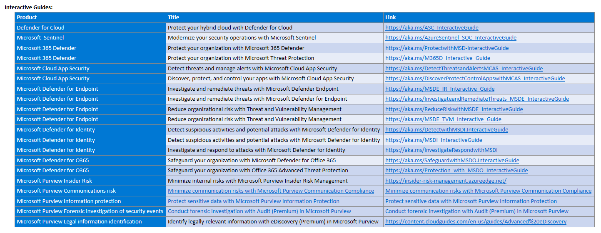

## Interactive Guides:

-   [Defender for Cloud](<https://aka.ms/ASC_InteractiveGuide>)
-   [Microsoft Sentinel](https://aka.ms/AzureSentinel_SOC_InteractiveGuide)
-   [M365 Defender](https://aka.ms/ProtectwithMSD-InteractiveGuide)
-   [M365 Defender - Threat Protection](https://aka.ms/M365D_Interactive_Guide)
-   [MCAS - Detect Threat and manage Alerts](https://aka.ms/DetectThreatsandAlertsMCAS_InteractiveGuide)
-   [MCAS - Discover, protect and control your Apps](https://aka.ms/DiscoverProtectControlAppswithMCAS_InteractiveGuide)
-   [MDE - Investigate Threats](https://aka.ms/MSDE_IR_Interactive_Guide)
-   [MDE - Investigate and Remediate Threats](https://aka.ms/InvestigateandRemediateThreats_MSDE_InteractiveGuide)
-   [MDE - Reduce Risk](https://aka.ms/ReduceRiskwithMSDE_InteractiveGuide)
-   [MDE - Threat and Vulnerability Management](https://aka.ms/MSDE_TVM_Interactive_Guide)
-   [MDI - Detect Suspicious Activities](https://aka.ms/DetectwithMSDI.InteractiveGuide)
-   [MDI - Investigate Suspicious Activities](https://aka.ms/MSDI_InteractiveGuide)
-   [MDI - Investigate and Respond to Attacks](https://aka.ms/InvestigateRespondwithMSDI)
-   [MDO - Safeguard Email](https://aka.ms/SafeguardwithMSDO.InteractiveGuide)
-   [MDO - Enable Protection](https://aka.ms/Protection_with_MSDO_InteractiveGuide)
-   [Purview Insider Risk Management](https://insider-risk-management.azureedge.net/)
-   [Purview Communications Risk](https://mslearn.cloudguides.com/en-us/guides/Minimize%20communication%20risks%20with%20communication%20compliance%20in%20Microsoft%20365) 
-   [Purview Information Protection](https://mslearn.cloudguides.com/en-us/guides/Protect%20sensitive%20data%20with%20Microsoft%20Information%20Protection)
-   [Purview Forensic investigation of Security events](https://mslearn.cloudguides.com/en-us/guides/Conduct%20forensic%20investigations%20with%20Advanced%20Audit%20in%20Microsoft%20365)
-   [Purview eDiscovery](https://content.cloudguides.com/en-us/guides/Advanced%20eDiscovery)

 
(Still working on Tables)## Product Trials:

-   [Microsoft Defender for Identity](https://signup.microsoft.com/Signup?OfferId=a0db242a-96d7-4f99-bd52-05c0d5556257&ali=1)
-   [Microsoft Defender for Office 365 P2](https://signup.microsoft.com/signup/logout?OfferId=20298c4d-d500-47fa-b3cd-a3f7d75d9253)
-   [Microsoft Defender for Endpoint P2](https://signup.microsoft.com/create-account/signup?products=7f379fee-c4f9-4278-b0a1-e4c8c2fcdf7e&ru=https://aka.ms/MDEp2OpenTrial)
-   [Microsoft 365 E5 Security](https://signup.microsoft.com/Signup?OfferId=b73fce33-ac89-4175-b199-0173b4c74b1f&ali=1)
-   [Microsoft Defender for IoT](https://azure.microsoft.com/en-us/free/)
-   [Microsoft Defender for Cloud Apps](https://signup.microsoft.com/Signup?OfferId=757C4C34-D589-46E4-9579-120BBA5C92ED)
-   [Microsoft Defender for Cloud Apps -- App Governance add-on](https://signup.microsoft.com/get-started/signup?products=a52e9277-0d85-4480-8cae-a84bc2ab32ae&culture=en-us&country=US&ali=1&bac=1&signedinuser=v-kschaefer%40microsoft.com)
-   [Microsoft Sentinel](https://azure.microsoft.com/en-us/free/)
-   [Microsoft Defender for Office 365](https://docs.microsoft.com/microsoft-365/security/office-365-security/trial-playbook-defender-for-office-365)
-   [Microsoft Sentinel Labs](https://github.com/Azure/Azure-Sentinel)
-   [Microsoft Defender for Endpoint P2](https://docs.microsoft.com/en-us/microsoft-365/security/defender-endpoint/defender-endpoint-trial-playbook?view=o365-worldwide)
-   [Microsoft Purview Solutions](https://docs.microsoft.com/microsoft-365/compliance/compliance-easy-trials-compliance-playbook)
-   [Microsoft Purview Compliance Manager premium assessments](https://docs.microsoft.com/microsoft-365/compliance/compliance-easy-trials-compliance-manager-assessment-playbook)
-   [Microsoft 365 E5 Insider Risk Management](https://signup.microsoft.com/signup?OfferId=7B74C69A-2BFC-41C9-AAF1-23070354622D)
-   [Microsoft 365 E5 Information Protection & Governance](https://signup.microsoft.com/signup?OfferId=503D4D1D-0169-4E1F-AE26-DB041C54C5C4)
-   [Microsoft 365 E5 Compliance](https://signup.microsoft.com/Signup?OfferId=d53d8416-fd1f-4552-831c-b5828ef2cbde&ali=1)
-   [Microsoft Compliance Manager premium assessment](https://signup.microsoft.com/get-started/signup?products=e320704d-b7c9-4012-b6a6-0a2679790360&culture=en-us&country=US&ali=1)
-   [Microsoft 365 E5 eDiscovery & Audit](https://signup.microsoft.com/signup?OfferId=c6ca396f-4467-4761-95f6-b6d9a5386716)
-   [Microsoft Priva](https://docs.microsoft.com/privacy/priva/priva-trial-playbook)
-   [Microsoft Priva Privacy Risk Management](https://signup.microsoft.com/get-started/signup?products=e6b633e0-1b1e-4d95-b414-3ce9e8023c39)
-   [Microsoft Priva Subject Rights Requests](https://signup.microsoft.com/get-started/signup?products=1c6c565d-cae2-4648-aa92-bf52b523fdbd)
