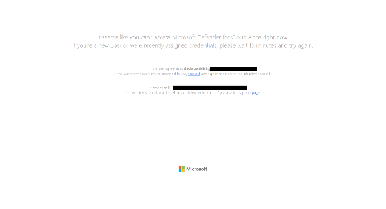

## MDCA (Microsoft Defender for Cloud Apps, was MCAS):

-   URL <https://security.microsoft.com/cloudapps/settings>

---------------------------------------------------------------------------------------------------------------------------
  **Bad Image**                                                 **Good Image**
------------------------------------------------------------- -------------------------------------------------------------
     
                                

---------------------------------------------------------------------------------------------------------------------------

-   ### Troubleshooting
    <https://learn.microsoft.com/en-us/defender-cloud-apps/troubleshooting-cloud-discovery>
-   Tune the system: <https://learn.microsoft.com/en-us/defender-cloud-apps/tutorial-suspicious-activity>
-   Tell it what the Corporate IP address's are: <https://learn.microsoft.com/en-us/defender-cloud-apps/ip-tags>
-   Set the IP's in bulk if needed: <https://learn.microsoft.com/en-us/defender-cloud-apps/api-data-enrichment-manage-script>
-   Best Practices: <https://learn.microsoft.com/en-us/defender-cloud-apps/best-practices>
-   Daily Activities: <https://learn.microsoft.com/en-us/defender-cloud-apps/daily-activities-to-protect-your-cloud-environment>
-   Apps list
-   Sanctioned/Unsanctioned
-   Don't forget this is based on MDE