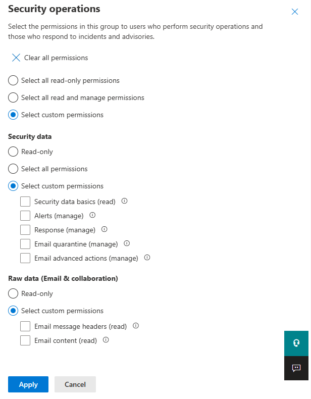

## **MDE (Microsoft Defender for Endpoint)**

### **Ways of working**

Defender for Endpoint is for Endpoints, Servers actually belong in "Defender for Cloud":
<https://learn.microsoft.com/en-us/microsoft-365/security/defender-endpoint/migrating-mde-server-to-cloud>

- **Architecture PDF**
<https://download.microsoft.com/download/5/6/0/5609001f-b8ae-412f-89eb-643976f6b79c/mde-deployment-strategy.pdf>

- **Plan your deployement**
<https://learn.microsoft.com/en-us/microsoft-365/security/defender-endpoint/deployment-strategy?view=o365-worldwide>

- **MDE Deployment overview**
<https://learn.microsoft.com/en-us/microsoft-365/security/defender-endpoint/deployment-phases?view=o365-worldwide>

- **Phase 1 - Prepare** [Link](<https://learn.microsoft.com/en-us/microsoft-365/security/defender-endpoint/prepare-deployment?view=o365-worldwide>)
  - Stakeholders and approval
  - Environment
  - RBAC
  - Adoption Order

- **Phase 2 - Setup** [Link](<https://learn.microsoft.com/en-us/microsoft-365/security/defender-endpoint/production-deployment?view=o365-worldwide>)
  - Check License state
  - CSP Validation
  - Tenant Config
  - Data Centre location
  - Network Config

- **Phase 3 - Onbaording** [Link](<https://learn.microsoft.com/en-us/microsoft-365/security/defender-endpoint/production-deployment?view=o365-worldwide>)
  - [Onboarding & Config](https://learn.microsoft.com/en-us/microsoft-365/security/defender-endpoint/onboarding?view=o365-worldwide)
  - [Deployment Rings](https://learn.microsoft.com/en-us/microsoft-365/security/defender-endpoint/deployment-rings?view=o365-worldwide)
  - [Using Config Manager](https://learn.microsoft.com/en-us/microsoft-365/security/defender-endpoint/onboarding-endpoint-configuration-manager?view=o365-worldwide)
  - [Using MEM](https://learn.microsoft.com/en-us/microsoft-365/security/defender-endpoint/onboarding-endpoint-manager?view=o365-worldwide)

### **Enable Telemetry**

- Onbarding & Configuration
<https://learn.microsoft.com/en-us/microsoft-365/security/defender-endpoint/onboarding-endpoint-manager?view=o365-worldwide>

- Configure Device Discovery
<https://learn.microsoft.com/en-us/microsoft-365/security/defender-endpoint/configure-device-discovery>
- **Check it's working -->** using Simulated Attacks
<https://learn.microsoft.com/en-us/microsoft-365/security/defender-endpoint/attack-simulations>
- Automation Levels
<https://learn.microsoft.com/en-us/microsoft-365/security/defender-endpoint/automation-levels?>
- **Configure AIR capabilities**
<https://learn.microsoft.com/en-us/microsoft-365/security/defender-endpoint/configure-automated-investigations-remediation>
- **Attack Surface Reduction (ASR) rules**
<https://learn.microsoft.com/en-us/microsoft-365/security/defender-endpoint/attack-surface-reduction>
- **ASR Rules Deployment**
<https://learn.microsoft.com/en-us/microsoft-365/security/defender-endpoint/attack-surface-reduction-rules-deployment>

- Attack surface reduction (ASR) rules report
<https://learn.microsoft.com/en-us/microsoft-365/security/defender-endpoint/attack-surface-reduction-rules-report?>

### **Validate and Test**

- Scenarios & Features listed with links to testing
<https://learn.microsoft.com/en-us/microsoft-365/security/defender-endpoint/defender-endpoint-demonstrations>
- Block at First Sight - test/demo
<https://demo.wd.microsoft.com/Page/BAFS>
- **Demonstrate & Test security controls:** ASR, SmartScreen, PUA, etc...
<https://demo.wd.microsoft.com/>

### **Migration**

- Migration Guide
<https://learn.microsoft.com/en-us/microsoft-365/security/defender-endpoint/migration-guides?>

- Migrate to MDE from non-Microsoft endpoint protection
<https://learn.microsoft.com/en-us/microsoft-365/security/defender-endpoint/switch-to-mde-overview?>

- Manage Microsoft Defender for Endpoint after initial setup or migration
<https://learn.microsoft.com/en-us/microsoft-365/security/defender-endpoint/manage-mde-post-migration?>

### **Enable Reporting**

Consider consolidating All reporting below into Workbooks in Sentinel, this can typically be provided by a Partner, part of an MSSP process, or you can roll your own?

- Device health reports in MDE
<https://learn.microsoft.com/en-us/microsoft-365/security/defender-endpoint/device-health-reports?>

- Manage MDE Devices with MEM
<https://learn.microsoft.com/en-us/mem/intune/protect/mde-security-integration>

- Fix unhealthy sensors in MDE
<https://learn.microsoft.com/en-us/microsoft-365/security/defender-endpoint/fix-unhealthy-sensors?>

- Host firewall reporting in MDE
<https://learn.microsoft.com/en-us/microsoft-365/security/defender-endpoint/host-firewall-reporting?view=o365-worldwide>

- MDE PowerBI
<https://github.com/microsoft/MicrosoftDefenderForEndpoint-PowerBI>

- PowerShell scripts using MDE public API
<https://github.com/microsoft/MicrosoftDefenderATP-API-PowerShell>

- MDE Advanced Hunting (AH) sample queries
<https://github.com/microsoft/WindowsDefenderATP-Hunting-Queries>

- Python scripts using MDE public API
<https://github.com/microsoft/MicrosoftDefenderATP-API-Python>

### **Review and Improve as needed**

- Consider enabling Block at First Sight from AV: <https://learn.microsoft.com/en-us/microsoft-365/security/defender-endpoint/configure-block-at-first-sight-microsoft-defender-antivirus>

- **Linux Advanced Guidance:** <https://learn.microsoft.com/en-us/microsoft-365/security/defender-endpoint/comprehensive-guidance-on-linux-deployment>

### **Troubleshooting**

- Troubleshooting: <https://learn.microsoft.com/en-us/microsoft-365/security/defender-endpoint/check-sensor-status>
- **Troubleshooting mode for devices**: <https://jeffreyappel.nl/microsoft-defender-for-endpoint-troubleshooting-mode-how-to-use-it/>
- Migration Guide: <https://learn.microsoft.com/en-us/microsoft-365/security/defender-endpoint/migration-guides>

### **M365 RBAC**

**Released late Dec 2022**

- Shortcut to RBAC Permissions
<https://security.microsoft.com/mtp_roles>
- Compare RBAC Roles
<https://learn.microsoft.com/en-us/microsoft-365/security/defender/compare-rbac-roles?>
- Edit and Delete Roles
<https://learn.microsoft.com/en-us/microsoft-365/security/defender/edit-delete-rbac-roles?>

### **MDE using ASR stand-alone (E3)**

Handy tips and shortcuts for those that might still be trying to improve based on M365 E3 Licensing - apologies but this is not my focus, but when I do come across useful tips and links I'll add here:

- <https://www.computerworld.com/article/3604651/decoding-windows-defender-s-hidden-settings.html>
- <https://github.com/AndyFul/ConfigureDefender>
- <https://www.defenderui.com/>
- <https://github.com/beerisgood/Windows11_Hardening>
- <https://jeffreyappel.nl/microsoft-defender-for-endpoint-series-define-the-av-baseline-part4a/>
