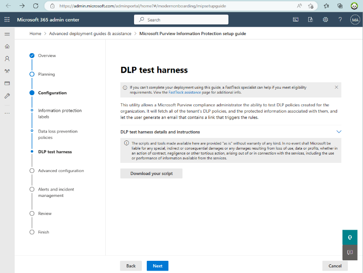

## Microsoft Information Protection (MIP/AIP)

This page will also cover DLP, but we'll probably build out a whole new section on Purview as this site matures, thank you for your patience - please feel free to provide feedback via raising an issue in Github.

- MIP/AIP - <https://techcommunity.microsoft.com/t5/security-compliance-and-identity/azure-information-protection-and-the-information-protection/ba-p/3671070>
-   Adaptive Protection (DLP rules based on Insider Risk)
-   Login as GA (or eqiv.) - <https://admin.microsoft.com/adminportal/home?#/modernonboarding/mipsetupguide>
-   
-   Docs - <https://learn.microsoft.com/en-gb/microsoft-365/compliance/information-protection>
-   DLP - <https://learn.microsoft.com/en-gb/microsoft-365/compliance/dlp-learn-about-dlp>
-   What's new - <https://learn.microsoft.com/en-gb/microsoft-365/compliance/whats-new>