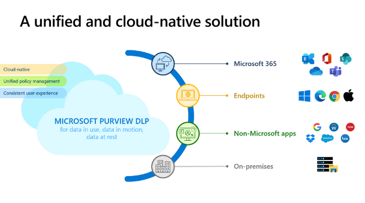
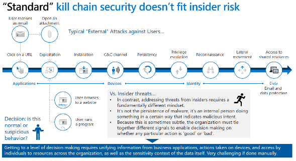
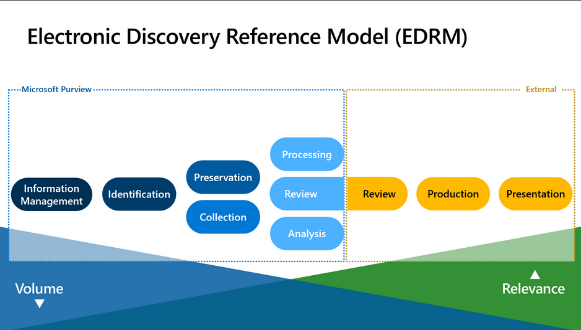

## Ninja Security Training:

-   M365 Defender : <https://aka.ms/m365dninja>
-   Microsoft Defender for Endpoint: <https://aka.ms/mdeninja>
-   Microsoft Defender for Identity : <https://aka.ms/MDINinja>
-   Microsoft Defender for O365 : <https://aka.ms/mdoninja>
-   Microsoft Defender for Cloud Apps: <http://aka.ms/mcasninja> (formerly MCAS)
-   Microsoft Sentinel : <https://aka.ms/sentinelninja>
-   Microsoft Sentinel for MSSP : <http://aka.ms/azsentinelmssp>
-   Microsoft Defender for Cloud : <http://aka.ms/ascninja>
-   Microsoft Defender Threat Intelligence : <https://techcommunity.microsoft.com/t5/microsoft-defender-threat/become-a-microsoft-defender-threat-intelligence-ninja-the/ba-p/3656965>
-   Azure Network Security Ninja : <http://aka.ms/aznetsecninja>
-   Microsoft Defender for IoT: <https://aka.ms/d4iotninja>
-   Microsoft Purview Information Protection: <https://aka.ms/mipninja>
 
-   Microsoft Purview DLP ninja: <https://aka.ms/DLPNinja>
 
-   Microsoft Purview Insider Risk Management: <https://aka.ms/insiderriskninja>
 
-   Microsoft Purview eDiscovery: <https://aka.ms/ediscoveryninja>
 
-   Microsoft Purview Communication Compliance: <https://aka.ms/communicationcomplianceninja>
-   Microsoft Purview Compliance Manager: <http://aka.ms/compliancemanagerninja>
-   Sentinel Automation: <https://techcommunity.microsoft.com/t5/microsoft-sentinel-blog/become-a-microsoft-sentinel-automation-ninja/ba-p/3563377>
-   Sentinel Notebooks: <https://techcommunity.microsoft.com/t5/microsoft-sentinel-blog/becoming-a-microsoft-sentinel-notebooks-ninja-the-series/ba-p/2693491>
-   Must Learn KQL: <https://github.com/rod-trent/MustLearnKQL>
-   Kusto Detective Agency: <https://detective.kusto.io>
-   Microsoft Defender for Endpoint Trial: <https://aka.ms/mdetrial>
-   Exam SC-900: <https://learn.microsoft.com/en-us/certifications/exams/sc-900>
-   Exam SC-200: <https://learn.microsoft.com/en-us/certifications/exams/sc-200>