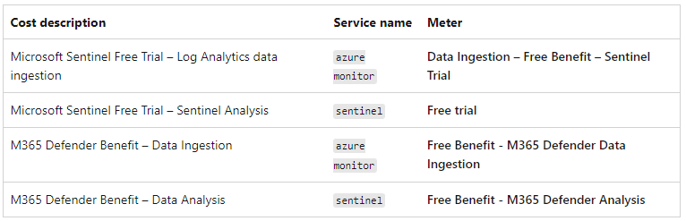

## Sentinel Tips from the Field:

!!! tip "You want SOAR?" 

    -   Most folks skip Defender in preference for Sentinel...  
    -   Start from the desired outcome and work your way back from there
    -   What is it that SecOps need? - more automation, less manual work ;-)
    -   What does that look like? Showcase an example from Contoso Hotels
    -   Enable Automated Investigation & Remediation (AIR) at MDI, MDO, MDE and M365 Defender console levels - **don't skip this!** - as this enables SOAR "at source"
    -   Now that we have the first level triage in place, let's now move on to Sentinel...

Cost Optimization tips from Rod Trent:
<https://github.com/rod-trent/Azure-Sentinel-Cost-Troubleshooting-Kit>

-   <https://learn.microsoft.com/en-us/azure/sentinel/best-practices>
-   <https://techcommunity.microsoft.com/t5/microsoft-sentinel-blog/best-practices-for-designing-a-microsoft-sentinel-or-azure/ba-p/832574>
-   <https://learn.microsoft.com/en-us/azure/sentinel/extend-sentinel-across-workspaces-tenants>
-   <https://learn.microsoft.com/en-us/azure/sentinel/best-practices-workspace-architecture>
-   [Microsoft Sentinel benefit for Microsoft 365 E5
    Customers](https://azure.microsoft.com/en-gb/offers/sentinel-microsoft-365-offer/)
-   Security Data Types -
    <https://docs.microsoft.com/en-us/azure/defender-for-cloud/enhanced-security-features-overview#what-data-types-are-included-in-the-500-mb-data-daily-allowance>
-   General recommendation is for Customers to focus efforts on increasing efficiency and reducing TTR (time to remediate) via Automation & SOAR natively within Microsoft Sentinel will naturally improve C3 (SecOps) efficiency without the need for any additional tools.
    -   More information:
    -   [CISO series: Lessons learned from the Microsoft SOC---Part 3a: Choosing SOC tools](https://www.microsoft.com/security/blog/2019/10/07/ciso-series-lessons-learned-from-the-microsoft-soc-part-3a-choosing-soc-tools/)
    -   [CISO series: Lessons learned from the Microsoft SOC---Part 3b: A day in the life](https://www.microsoft.com/security/blog/2019/12/23/ciso-series-lessons-learned-from-the-microsoft-soc-part-3b-a-day-in-the-life/)
    -   [CISO Series: Lessons learned from the Microsoft SOC---Part 3c: A day in the life part 2](https://www.microsoft.com/security/blog/2020/05/04/lessons-learned-microsoft-soc-part-3c/)

 
-   Raw logs by their very nature have a significant cost related to "data gravity" - the more Customers move/copy the logs the more complex the environment as well as more expensive the solution becomes - the design principle that should be recommend is to adhere to the MS Best Practices as much as possible.
    <https://learn.microsoft.com/en-us/azure/sentinel/best-practices-data>
-   Should there be any business justification or requirement for "raw logs" please consider a much more efficient method is the ability to stream "advanced hunting" events:
-   Why ingest or duplicate massive data sets across multiple systems based on a "just in case" scenario
-   A much more efficient system would be to define the "advanced hunting" event that is being searched for and as and when matches are discovered the event is forwarded
-   This process will respect data gravity and reduce costs significantly
-   More information can be found here: [Advanced hunting event collection](https://docs.microsoft.com/en-us/azure/sentinel/microsoft-365-defender-sentinel-integration#advanced-hunting-event-collection)

-   ### Azure Log Management:

    -   [Design a Log Analytics workspace architecture - Azure Monitor](https://nam06.safelinks.protection.outlook.com/?url=https%3A%2F%2Flearn.microsoft.com%2Fen-us%2Fazure%2Fazure-monitor%2Flogs%2Fworkspace-design&data=05%7C01%7Cdavecaddick%40microsoft.com%7Ca9c6aea6a2e34b1a57c008dabba5de49%7C72f988bf86f141af91ab2d7cd011db47%7C1%7C0%7C638028618327569401%7CUnknown%7CTWFpbGZsb3d8eyJWIjoiMC4wLjAwMDAiLCJQIjoiV2luMzIiLCJBTiI6Ik1haWwiLCJXVCI6Mn0%3D%7C3000%7C%7C%7C&sdata=1CPvtNtBZPRUtrYS464Iw0I%2B1E9BNKr7Fid9cVN9hbQ%3D&reserved=0)

    -   [Workspace architecture best practices for Microsoft Sentinel](https://nam06.safelinks.protection.outlook.com/?url=https%3A%2F%2Flearn.microsoft.com%2Fen-us%2Fazure%2Fsentinel%2Fbest-practices-workspace-architecture&data=05%7C01%7Cdavecaddick%40microsoft.com%7Ca9c6aea6a2e34b1a57c008dabba5de49%7C72f988bf86f141af91ab2d7cd011db47%7C1%7C0%7C638028618327569401%7CUnknown%7CTWFpbGZsb3d8eyJWIjoiMC4wLjAwMDAiLCJQIjoiV2luMzIiLCJBTiI6Ik1haWwiLCJXVCI6Mn0%3D%7C3000%7C%7C%7C&sdata=FJ25vCIn0M75eSXIeSiSkGnLEAQYoNbzUKKAdcPfAM8%3D&reserved=0)

    -   [Best practices for data collection in Microsoft Sentinel](https://nam06.safelinks.protection.outlook.com/?url=https%3A%2F%2Flearn.microsoft.com%2Fen-us%2Fazure%2Fsentinel%2Fbest-practices-data&data=05%7C01%7Cdavecaddick%40microsoft.com%7Ca9c6aea6a2e34b1a57c008dabba5de49%7C72f988bf86f141af91ab2d7cd011db47%7C1%7C0%7C638028618327569401%7CUnknown%7CTWFpbGZsb3d8eyJWIjoiMC4wLjAwMDAiLCJQIjoiV2luMzIiLCJBTiI6Ik1haWwiLCJXVCI6Mn0%3D%7C3000%7C%7C%7C&sdata=gVLZDafeeOVo4O%2FCFrtjb98t2GIx5wKaOkXZplFxmXc%3D&reserved=0)

-   ### Filtering Logs: 

    Can be used to reduce data noise, reduce ingestion and retention/storage costs with the goal being to focus on the logs and events that are relevant - This is typically performed by one of the methods for the following scenarios:

    -   Server Log Ingestion - Azure Monitor Agent Directly can filter out logs that are not relevant for Microsoft Sentinel <https://docs.microsoft.com/en-us/azure/sentinel/best-practices-data#filter-your-logs-before-ingestion>

    -   Syslog and CEF Ingestion -- Using a log forwarder such as Logstash can parse the logs based on Customers defined rules
        <https://docs.microsoft.com/en-us/azure/sentinel/best-practices-data#filter-your-logs-before-ingestion>

    -   Custom REST API Ingestion -- Via the Function or Logic App, data can be stripped away prior to sending to Microsoft sentinel

    -   Looking deeper into the "Free data meters" it is possible to use this URL to find the following Table
    <https://docs.microsoft.com/en-us/azure/sentinel/billing?tabs=free-data-meters#understand-your-microsoft-sentinel-bill>

The following table shows how Microsoft Sentinel and Log Analytics costs appear in the Service name and Meter columns of your Azure bill for free data services. For more information, see [View Data Allocation Benefits](https://docs.microsoft.com/en-us/azure/azure-monitor/usage-estimated-costs#view-data-allocation-benefits).

> 

 

### Sentinel - Recommendation to enable M365 Defender Connector:
- More information: <https://docs.microsoft.com/en-us/azure/sentinel/microsoft-365-defender-sentinel-integration>

-   [Incident creation rules](https://learn.microsoft.com/en-us/azure/sentinel/microsoft-365-defender-sentinel-integration#microsoft-365-defender-incidents-and-microsoft-incident-creation-rules) that need to be mindful of to avoid creating multiple Incidents

-   [Bi-directional Sync](https://learn.microsoft.com/en-us/azure/sentinel/microsoft-365-defender-sentinel-integration#working-with-microsoft-365-defender-incidents-in-microsoft-sentinel-and-bi-directional-sync) between M365 Defender & Sentinel

-   Focus on bringing all source logging relevant to the Users Device into the one location where it can be corelated quickly and seamlessly into a SOAR process to reduce friction and improve TTR times for SecOps
More information: <https://docs.microsoft.com/en-us/azure/sentinel/microsoft-365-defender-sentinel-integration>

 

>**Sentinel Free Data ingestion:** always remember "data collection" is NOT detection!!

- <https://learn.microsoft.com/en-us/azure/sentinel/billing?tabs=free-data-meters#free-data-sources>
- <https://learn.microsoft.com/en-us/azure/sentinel/billing-monitor-costs#view-costs-by-using-cost-analysis>
- <https://learn.microsoft.com/en-us/azure/sentinel/billing-monitor-costs#run-queries-to-understand-your-data-ingestion>
- <https://learn.microsoft.com/en-us/azure/sentinel/billing-monitor-costs#deploy-a-workbook-to-visualize-data-ingestion>
- <https://learn.microsoft.com/en-us/azure/sentinel/billing-reduce-costs#separate-non-security-data-in-a-different-workspace>
- <https://learn.microsoft.com/en-us/azure/sentinel/billing-reduce-costs#optimize-log-analytics-costs-with-dedicated-clusters>
- <https://learn.microsoft.com/en-us/azure/sentinel/best-practices-data#filter-your-logs-before-ingestion>

This recent addition looks adventerous - but you might at least want to review the logic and have an alert sent to the team when you should be **prompted** to review or change the pricing tier? Don't forget to make sure the LAW is changed as well at the same time :)

Automatically auto-scale your Sentinel pricing tiers:
<https://koosg.medium.com/auto-scale-your-sentinel-pricing-tiers-3d1f46b4c6ce>